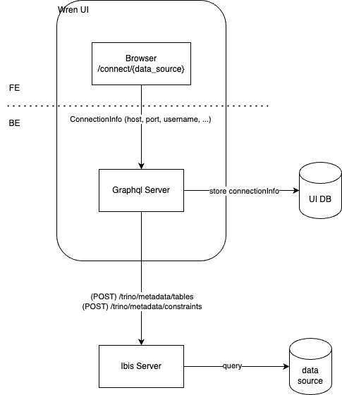

# Guia de Contribuicao

*Pull requests, bug reports e qualquer outra forma de contribuicao sao bem-vindos e altamente incentivados!* :octocat:

### Conteudo

- [Codigo de Conduta](#book-codigo-de-conduta)
- [Visao Geral](#mag-visao-geral)
- [Guia de Contribuicao por Servico](#love_letter-guia-de-contribuicao-por-servico)
- [Criando um Novo Conector de Fonte de Dados](#electric_plug-criando-um-novo-conector-de-fonte-de-dados)

> **Este guia define expectativas claras para todas as pessoas envolvidas no projeto, para que possamos evoluir juntos e manter um espaco acolhedor de participacao. Seguir estas diretrizes ajuda a garantir uma experiencia positiva para contribuidores e mantenedores.**

## :book: Codigo de Conduta

Revise nosso [Code of Conduct](https://github.com/Canner/WrenAI/blob/main/CODE_OF_CONDUCT.md). Ele vale em todos os momentos. Esperamos que seja respeitado por todos que contribuem com este projeto. Comportamento ofensivo nao sera tolerado.

## :rocket: Como comecar
1. Visite [How Wren AI works?](https://docs.getwren.ai/oss/overview/how_wrenai_works) para entender a arquitetura do Wren AI.
1. Depois de entender a arquitetura, defina o escopo do servico para o qual voce quer contribuir.
  Consulte cada secao em [Guia de Contribuicao por Servico](#love_letter-guia-de-contribuicao-por-servico) para saber como contribuir em cada servico.
1. Se voce esta lidando com tarefas de UI, como adicionar modo escuro, contribua apenas no [Wren UI Service](#wren-ui-service).
1. Se voce esta lidando com tarefas relacionadas a LLM, como melhorar prompts de pipelines, contribua apenas no [Wren AI Service](#wren-ai-service).
1. Se voce esta trabalhando em tarefas de fonte de dados, como corrigir bug de conector SQL Server, contribua no [Wren Engine Service](#wren-engine-service).
1. Se nao tiver certeza de qual servico alterar, fale conosco no [Discord](https://discord.gg/canner) ou em [GitHub Issues](https://github.com/Canner/WrenAI/issues).
1. Pode ser necessario contribuir em varios servicos. Por exemplo, ao adicionar uma nova fonte de dados, voce precisara contribuir no [Wren UI Service](#wren-ui-service) e no [Wren Engine Service](#wren-engine-service). Siga [Guia para Contribuir em Multiplos Servicos](#guia-para-contribuir-em-multiplos-servicos).

## :love_letter: Guia de Contribuicao por Servico

### Wren AI Service

O Wren AI Service e responsavel por tarefas relacionadas a LLM, como converter perguntas em linguagem natural para consultas SQL e fornecer explicacoes SQL passo a passo.

Para contribuir no Wren AI Service, consulte [Wren AI Service Contributing Guide](https://github.com/Canner/WrenAI/blob/main/wren-ai-service/CONTRIBUTING.md)

### Wren UI Service

Wren UI e o servico cliente do WrenAI. Ele e construido com Next.js e TypeScript.
Para contribuir no Wren UI, consulte [WrenAI/wren-ui/README.md](https://github.com/Canner/WrenAI/blob/main/wren-ui/README.md) para instrucoes de setup e execucao do servidor de desenvolvimento.

### Wren Engine Service
Wren Engine e a espinha dorsal do projeto Wren AI. E o engine semantico para LLMs, trazendo contexto de negocio para agentes de IA.

Para contribuir, consulte [Wren Engine Contributing Guide](https://github.com/Canner/wren-engine/blob/main/ibis-server/docs/CONTRIBUTING.md)

## Guia para contribuir em multiplos servicos
Usamos docker-compose para iniciar todos os servicos. Se voce estiver contribuindo em varios servicos, pode comentar os servicos que deseja iniciar pelo codigo-fonte e ajustar variaveis de `env` para apontar para os servicos que iniciou manualmente.

### Exemplo: contribuindo no [Wren UI Service](#wren-ui-service) e no [Wren Engine Service](#wren-engine-service)
Se voce estiver contribuindo nos dois servicos, comente o servico `wren-engine` em `docker/docker-compose-dev.yml` (a UI ja esta excluida nesse arquivo). Em seguida, ajuste variaveis de ambiente no `.env` para apontar para os servicos iniciados manualmente. Assim o ambiente local integra corretamente com os servicos em que voce esta trabalhando.

1. Prepare o arquivo `.env`: na pasta `WrenAI/docker`, use `.env.example` como template e crie `.env.local`.
  ```sh
  # assumindo que o diretorio atual e wren-ui
  cd ../docker
  cp .env.example .env.local
  ```
1. Modifique `.env.local`: preencha `OPENAI_API_KEY` com sua chave da OpenAI antes de iniciar.
1. Na pasta `WrenAI/docker`, copie `config.example.yaml` para `config.yaml` para configuracao do AI service. Altere tambem `http://wren-ui:3000` para `http://host.docker.internal:3000` em `config.yaml`.
1. Inicie os servicos de UI e engine pelo codigo-fonte.
1. Atualize as variaveis de `env` no `.env.local` para apontar para os servicos iniciados manualmente.
1. Inicie os demais servicos com docker-compose:
  ```sh
  # diretorio atual: WrenAI/docker
  docker-compose -f docker-compose-dev.yaml --env-file .env.example up

  # voce pode adicionar -d para rodar em background
  docker-compose -f docker-compose-dev.yaml --env-file .env.example up -d
  # para parar os servicos, use
  docker-compose -f docker-compose-dev.yaml --env-file .env.example down
  ```
1. Bom codigo!

## :electric_plug: Criando um novo conector de fonte de dados

Para desenvolver um novo conector de fonte de dados, voce precisa alterar front-end e back-end do Wren UI, alem do Wren Engine.

Abaixo esta uma visao geral de um conector de fonte de dados:



A UI e responsavel principalmente por armazenar configuracoes de conexao com banco, oferecer interface para entrada desses dados e envia-los ao Engine, que realiza a conexao ao banco.

A UI precisa conhecer os detalhes de conexao exigidos pelo Engine. Portanto, a sequencia de implementacao e:

- Engine:
  - Implementar a nova fonte de dados (definir quais informacoes de conexao sao necessarias e como serao enviadas pela UI).
  - Implementar a API de metadados para acesso da UI.
- UI:
  - Back-End:
   - Armazenar com seguranca as informacoes de conexao.
   - Fornecer as informacoes de conexao ao Engine.
  - Front-End:
   - Preparar icone da fonte de dados.
   - Criar template de formulario para entrada das informacoes de conexao.
   - Atualizar lista de fontes de dados.

### Wren Engine

- Para implementar nova fonte de dados, consulte [How to Add a New Data Source](https://github.com/Canner/wren-engine/blob/main/ibis-server/docs/how-to-add-data-source.md).
- Depois de adicionar a nova fonte de dados, implemente a API de metadados para a UI.

  PRs anteriores que adicionaram fontes de dados:
  - [Add MSSQL data source](https://github.com/Canner/wren-engine/pull/631)
  - [Add MySQL data source](https://github.com/Canner/wren-engine/pull/618)
  - [Add ClickHouse data source](https://github.com/Canner/wren-engine/pull/648)

### Guia do Wren UI

Aqui descrevemos o que deve ser feito na UI para cada nova fonte de dados.

Se preferir aprender por exemplo, consulte esta [issue](https://github.com/Canner/WrenAI/issues/492) e este [PR](https://github.com/Canner/WrenAI/pull/535) sobre Trino.

#### Backend
1. Defina a fonte de dados em `wren-ui/src/apollo/server/dataSource.ts`
  - Defina os metodos `toIbisConnectionInfo` e `sensitiveProps`

1. Modifique o adaptador ibis em `wren-ui/src/apollo/server/adaptors/ibisAdaptor.ts`
  - Defina o tipo de connection info do ibis para a nova fonte de dados
  - Configure `dataSourceUrlMap` para a nova fonte

1. Modifique o repositorio em `wren-ui/src/apollo/server/repositories/projectRepository.ts`
  - Defina o tipo de connection info do wren ui para a nova fonte

1. Atualize o schema graphql em `wren-ui/src/apollo/server/schema.ts` para permitir uso da nova fonte na UI
  - Adicione a nova fonte no enum `DataSource`

1. Atualize a definicao de tipos em `wren-ui/src/apollo/server/types/dataSource.ts`
  - Adicione a nova fonte no enum `DataSourceName`

#### Frontend
1. Prepare o logo da fonte de dados:
  - O tamanho da imagem deve ser `40 x 40` px
  - Preferencialmente em formato SVG
  - Garanta que o logo esteja centralizado em um container de `30px` para manter padronizacao visual

  Exemplo:

  

1. Crie o template de formulario da fonte de dados:
  - Em `wren-ui/src/components/pages/setup/dataSources`, adicione um novo arquivo chamado `${dataSource}Properties.tsx`
  - Implemente nesse arquivo o formulario da nova fonte

1. Configure o template da fonte de dados:
  - Va para `wren-ui/src/utils/dataSourceType.ts`
  - Adicione imagem, nome e propriedades da nova fonte
  - Atualize os arquivos necessarios para incluir as configuracoes do novo template

1. Atualize a lista de fontes de dados:
  - Adicione a nova fonte ao enum `DATA_SOURCES` em `wren-ui/src/utils/enum/dataSources.ts`
  - Atualize arquivos relevantes em `wren-ui/src/components/pages/setup/` para incluir a nova fonte
  - Garanta que `wren-ui/src/apollo/server/adaptors/ibisAdaptor.ts` trate a nova fonte

1. Teste o novo conector:
  - Garanta que a nova fonte aparece na UI
  - Verifique se o formulario funciona corretamente
  - Teste a conexao com a nova fonte

