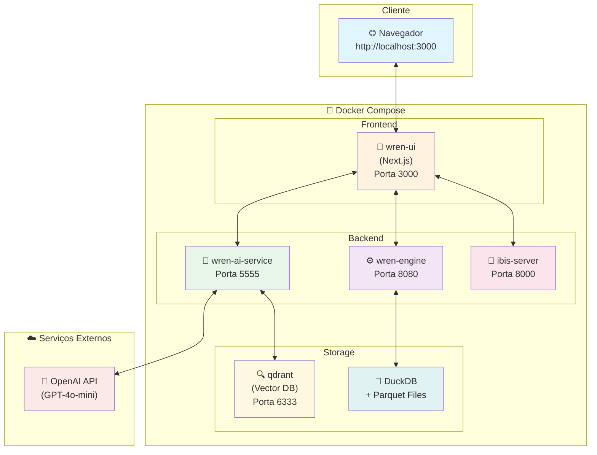
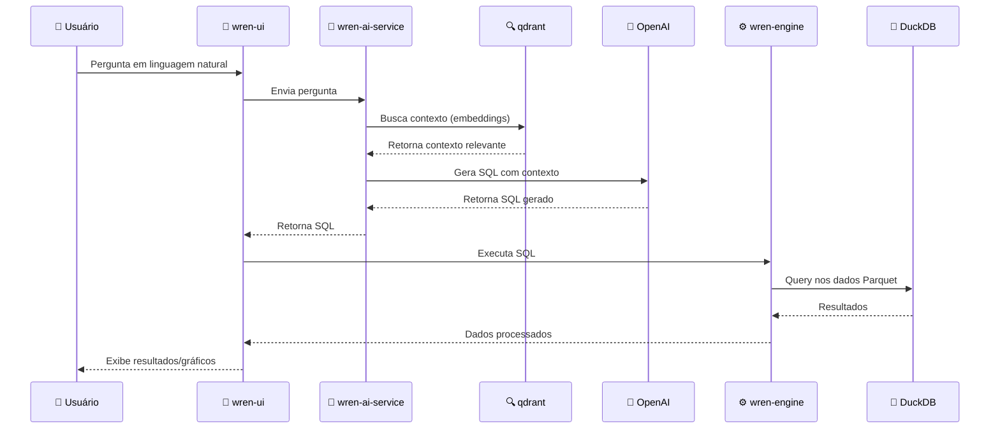

<div align="center">


### Text-to-SQL com IA para análise de dados

Fork customizado e estendido do [WrenAI](https://github.com/Canner/WrenAI), pronto para deploy em AWS via Terraform.

[](https://www.gnu.org/licenses/agpl-3.0)
[](docker/docker-compose.yaml)
[](aws/terraform/)
[](aws/architecture/DEPLOYMENT_GUIDE.md)

[Instalação](#instalação-rápida-docker) ·
[Deploy AWS](#-deploy-na-aws-via-terraform) ·
[Arquitetura](aws/architecture/ARCHITECTURE.md) ·
[Licença](#licença-e-atribuição)

</div>

---

## ✨ Sobre o projeto

**NucleAI** é uma plataforma de **Text-to-SQL com IA generativa** que permite consultar bancos de dados via linguagem natural. Construído sobre o [WrenAI](https://github.com/Canner/WrenAI) (Canner Inc.), o NucleAI adiciona:

- **Observabilidade nativa** via Langfuse v3 self-hosted (rastreamento de cada chamada LLM, custo e latência)
- **Configuração runtime de LLM** pela UI (troca de modelo sem reiniciar containers)
- **Toggle "Skip AI re-indexing"** para reduzir consumo de tokens durante desenvolvimento
- **Infraestrutura Terraform** completa para deploy em AWS EC2
- **Alertas de billing** automáticos via CloudWatch + SNS
- **Charts adicionais** (heatmap, scatter) e refinamentos de UI

### Stack técnica

| Camada | Tecnologia |
|--------|-----------|
| Frontend | Next.js 14, TypeScript, Apollo GraphQL, Ant Design |
| Backend AI | Python (FastAPI), Haystack, LiteLLM |
| Engine SQL | Wren Engine (Java), Ibis Server, DuckDB |
| Vector Store | Qdrant |
| Observabilidade | Langfuse v3 (Postgres + Clickhouse + Redis + MinIO) |
| Infraestrutura | Docker Compose, Terraform, AWS EC2 |

## 🖥️ Compatibilidade

| Sistema Operacional | Status | Método |
|---------------------|--------|--------|
| 🐧 Linux (Ubuntu 22.04+) | ✅ Testado | Docker nativo |
| 🪟 Windows 11 | ✅ Suportado | Docker Desktop + WSL2 |
| 🪟 Windows 10 | ⚠️ Parcial | Docker Desktop + WSL2 |
| 🍎 macOS | ⚠️ Não testado | Docker Desktop |
| ☁️ AWS EC2 (Amazon Linux 2023) | ✅ Testado | Terraform + Docker Compose |

## 📋 Índice

- [Pré-requisitos](#pré-requisitos)
- [Instalação Rápida (Docker)](#instalação-rápida-docker)
- [Deploy na AWS via Terraform](#-deploy-na-aws-via-terraform)
- [Configuração](#configuração)
- [Executando o Projeto](#executando-o-projeto)
- [Desenvolvimento Local](#desenvolvimento-local)
- [Customizações Realizadas](#customizações-realizadas)
- [Comandos Úteis](#comandos-úteis)
- [Solução de Problemas](#solução-de-problemas)
- [Licença e Atribuição](#licença-e-atribuição)

---

## Pré-requisitos

### Sistema Operacional
- Linux (testado em Ubuntu 22.04+)
- Windows 11 (com WSL2 ou Docker Desktop)

### Software Necessário

<details>
<summary><b>🐧 Linux</b></summary>

| Software | Versão Mínima | Instalação |
|----------|---------------|------------|
| Docker | 20.10+ | [Guia oficial](https://docs.docker.com/engine/install/) |
| Docker Compose | 2.0+ | Incluído no Docker Desktop |
| Git | 2.0+ | `sudo apt install git` |

#### Verificar instalação

```bash
docker --version          # Docker version 29.0.3 ou superior
docker compose version    # Docker Compose version v2.40.3 ou superior
```

#### Configurar permissões do Docker

```bash
# Adicionar usuário ao grupo docker (evita usar sudo)
sudo usermod -aG docker $USER

# Aplicar mudança (ou faça logout/login)
newgrp docker

# Verificar se funcionou
docker ps
```

</details>

<details>
<summary><b>🪟 Windows 11</b></summary>

| Software | Versão Mínima | Instalação |
|----------|---------------|------------|
| Docker Desktop | 4.0+ | [Download Docker Desktop](https://www.docker.com/products/docker-desktop/) |
| Git | 2.0+ | [Download Git](https://git-scm.com/download/win) |
| WSL2 | - | Habilitado pelo Docker Desktop |

#### Instalar Docker Desktop

1. Baixe o [Docker Desktop para Windows](https://www.docker.com/products/docker-desktop/)
2. Execute o instalador e siga as instruções
3. **Importante**: Marque a opção "Use WSL 2 instead of Hyper-V"
4. Reinicie o computador se solicitado
5. Abra o Docker Desktop e aguarde inicializar

#### Verificar instalação (PowerShell ou CMD)

```powershell
docker --version          # Docker version 29.0.3 ou superior
docker compose version    # Docker Compose version v2.40.3 ou superior
```

#### Habilitar WSL2 (se necessário)

```powershell
# Executar como Administrador no PowerShell
wsl --install
wsl --set-default-version 2
```

</details>

---

## Instalação Rápida (Docker)

### 1. Clonar o repositório

<details>
<summary><b>🐧 Linux / 🪟 Windows (Git Bash)</b></summary>

```bash
git clone https://github.com/Erick-Bryan-Cubas/nucleai-prod.git
cd nucleai-prod
```

</details>

<details>
<summary><b>🪟 Windows (PowerShell)</b></summary>

```powershell
git clone https://github.com/Erick-Bryan-Cubas/nucleai-prod.git
cd nucleai-prod
```

</details>

### 2. Configurar arquivos de ambiente

<details>
<summary><b>🐧 Linux / 🪟 Windows (Git Bash)</b></summary>

```bash
# Copiar arquivos de exemplo
cp docker/.env.example docker/.env
cp docker/config.example.yaml docker/config.yaml
```

</details>

<details>
<summary><b>🪟 Windows (PowerShell)</b></summary>

```powershell
# Copiar arquivos de exemplo
Copy-Item docker\.env.example docker\.env
Copy-Item docker\config.example.yaml docker\config.yaml
```

</details>

### 3. Configurar chave da OpenAI

<details>
<summary><b>🐧 Linux</b></summary>

```bash
nano docker/.env
```

</details>

<details>
<summary><b>🪟 Windows</b></summary>

```powershell
# Usando Notepad
notepad docker\.env

# Ou usando VS Code
code docker\.env
```

</details>

Encontre a linha e preencha:
```env
OPENAI_API_KEY=sk-sua-chave-aqui
```

Se preferir, voce pode iniciar com essa chave apenas como bootstrap e depois trocar pela interface em **Settings -> LLM e embeddings**, incluindo configuracoes mistas entre OpenAI e Ollama para chat e embeddings.

### 4. Subir os containers

<details>
<summary><b>🐧 Linux / 🪟 Windows</b></summary>

```bash
cd docker
docker compose up -d
```

</details>

### 5. Acessar a aplicação

Abra o navegador em: **http://localhost:3000**

---

## ☁️ Deploy na AWS via Terraform

O NucleAI pode ser publicado em uma instância EC2 com IP público fixo, gerenciada via Terraform. A infraestrutura completa (VPC, EC2, EIP, alertas de billing) está em [`aws/terraform/`](aws/terraform/).

### Pré-requisitos AWS

- Conta AWS no plano pago (não Free Tier — instância t3.xlarge não é elegível)
- [AWS CLI](https://docs.aws.amazon.com/cli/latest/userguide/getting-started-install.html) configurado: `aws configure`
- [Terraform](https://www.terraform.io/downloads) ≥ 1.5.0
- Usuário IAM com políticas: `AmazonEC2FullAccess`, `AmazonVPCFullAccess`, `AmazonSNSFullAccess`, `CloudWatchFullAccess`

### Comandos

```bash
cd aws/terraform

# 1) Copiar exemplo de variáveis
cp environments/prod.tfvars.example environments/prod.tfvars

# 2) Aplicar a infraestrutura (passe sua OpenAI key)
terraform init
terraform apply \
  -var-file=environments/prod.tfvars \
  -var="openai_api_key=sk-proj-..."
```

O Terraform provisiona:

| Recurso | Detalhe |
|---------|---------|
| VPC + Subnet pública | 1 AZ, `10.0.0.0/16` |
| Security Group | SSH (22) + HTTP (3000) abertos |
| EC2 t3.xlarge | 4 vCPU, 16 GB RAM, 50 GB gp3 |
| Elastic IP | IP público fixo |
| Key Pair RSA | Gerado e salvo como `nucleai-key.pem` |
| Alertas billing | CloudWatch + SNS em US$ 20, 40, 60, 80, 90 |

Após `apply`, o `user_data` da instância:
1. Instala Docker + Docker Compose
2. Clona este repositório
3. Gera `.env` com secrets aleatórios para Langfuse
4. Injeta `OPENAI_API_KEY` em `.env.runtime`
5. Roda `docker-compose up -d`

**Tempo total:** ~10 minutos até a UI ficar acessível.

### Outputs

```bash
terraform output
# application_url = "http://3.14.92.181:3000"
# ssh_command     = "ssh -i ./nucleai-key.pem ec2-user@3.14.92.181"
# init_log        = "ssh ... 'sudo tail -f /var/log/nucleai-init.log'"
```

### Custos estimados

| Período | Custo aproximado |
|---------|------------------|
| Hora | US$ 0,17 |
| Dia | US$ 4 |
| Semana (banca/demo) | US$ 28 |
| Mês | US$ 125 |

Guia detalhado em [aws/architecture/DEPLOYMENT_GUIDE.md](aws/architecture/DEPLOYMENT_GUIDE.md).

### Destruir tudo

```bash
terraform destroy \
  -var-file=environments/prod.tfvars \
  -var="openai_api_key=qualquer-valor"
```

---

## Configuração

### Arquivo `docker/.env`

| Variável | Descrição | Valor Padrão |
|----------|-----------|--------------|
| `OPENAI_API_KEY` | Chave da API OpenAI | (obrigatório) |
| `HOST_PORT` | Porta da UI | `3000` |
| `WREN_UI_VERSION` | Versão da imagem UI | `custom` (customizada) |
| `GENERATION_MODEL` | Modelo de IA | `gpt-4o-mini` |
| `TELEMETRY_ENABLED` | Telemetria | `true` |

### Arquivo `docker/config.yaml`

Configurações do serviço de IA. Consulte `docker/config.example.yaml` para opções disponíveis.

### Dados DuckDB

Os arquivos Parquet devem ser colocados em:
```
docker/data/gold/
├── auxiliar_processado.parquet
├── boletos_processado.parquet
└── bridge_cnpj.parquet
```

O SQL de inicialização está em `docker/data/init-duckdb.sql`.

---

## Executando o Projeto

### Iniciar todos os serviços

```bash
cd docker
docker compose up -d
```

### Verificar status dos containers

```bash
docker compose ps
```

Saída esperada:
```
NAME                       STATUS          PORTS
wrenai-wren-ui-1           Up             0.0.0.0:3000->3000/tcp
wrenai-wren-ai-service-1   Up             0.0.0.0:5555->5555/tcp
wrenai-wren-engine-1       Up             7432/tcp, 8080/tcp
wrenai-qdrant-1            Up             6333-6334/tcp
wrenai-ibis-server-1       Up             8000/tcp
```

### Parar os serviços

```bash
docker compose down
```

### Ver logs

```bash
# Todos os serviços
docker compose logs -f

# Serviço específico
docker compose logs -f wren-ui
```

---

## Desenvolvimento Local

Se você deseja modificar o código e testar localmente:

### Pré-requisitos adicionais

- Node.js 20.x LTS (use `nvm` ou `nvm-windows` para gerenciar versões)
- Yarn 4.x

### Instalar NVM e Node.js 20

<details>
<summary><b>🐧 Linux</b></summary>

```bash
# Instalar nvm
curl -o- https://raw.githubusercontent.com/nvm-sh/nvm/v0.40.1/install.sh | bash

# Recarregar shell
source ~/.bashrc

# Instalar Node 20
nvm install 20
nvm use 20

# Verificar
node --version  # v20.19.6
```

</details>

<details>
<summary><b>🪟 Windows</b></summary>

#### Opção 1: NVM for Windows (Recomendado)

1. Baixe o instalador em: https://github.com/coreybutler/nvm-windows/releases
2. Execute `nvm-setup.exe`
3. Abra um **novo** PowerShell como Administrador:

```powershell
# Instalar Node 20
nvm install 20
nvm use 20

# Verificar
node --version  # v20.19.6
```

#### Opção 2: Instalador direto do Node.js

1. Baixe o Node.js 20 LTS em: https://nodejs.org/
2. Execute o instalador `.msi`
3. Verifique a instalação:

```powershell
node --version  # v20.x.x
```

</details>

### Rodar wren-ui em modo dev

<details>
<summary><b>🐧 Linux / 🪟 Windows (Git Bash)</b></summary>

```bash
cd wren-ui

# Instalar dependências
yarn install

# Rodar migrações do banco
yarn migrate

# Iniciar em modo desenvolvimento
yarn dev
```

</details>

<details>
<summary><b>🪟 Windows (PowerShell)</b></summary>

```powershell
cd wren-ui

# Instalar dependências
yarn install

# Rodar migrações do banco
yarn migrate

# Iniciar em modo desenvolvimento
yarn dev
```

</details>

> ⚠️ **Importante**: O `yarn dev` precisa dos serviços backend rodando. Suba-os via Docker primeiro:
> 
> ```bash
> cd docker
> docker compose up -d wren-engine ibis-server qdrant wren-ai-service bootstrap
> ```

---

## Customizações Realizadas

### Logo Personalizada

Os arquivos de logo foram customizados:

| Arquivo | Localização |
|---------|-------------|
| Logo SVG principal | `wren-ui/public/images/logo-white-with-text.svg` |
| Componente Logo | `wren-ui/src/components/Logo.tsx` |
| Componente LogoBar | `wren-ui/src/components/LogoBar.tsx` |

### Aplicar customizações no Docker

Após modificar arquivos em `wren-ui/`, reconstrua a imagem:

<details>
<summary><b>🐧 Linux / 🪟 Windows</b></summary>

```bash
# 1. Build da imagem customizada
cd wren-ui
docker build -t ghcr.io/canner/wren-ui:custom -f Dockerfile .

# 2. Garantir que .env usa a versão custom
# WREN_UI_VERSION=custom

# 3. Reiniciar container
cd ../docker
docker compose up -d --force-recreate wren-ui
```

</details>

### Rebuild rápido só do wren-ui (preserva embeddings)

Durante desenvolvimento de front-end, rebuilde apenas o container da interface **sem apagar volumes** — assim o Qdrant mantém os embeddings e o SQLite mantém o `deploy_log`:

```bash
cd docker
docker compose build wren-ui && docker compose up -d wren-ui
```

> ⚠️ **Evite `docker compose down -v` em sessão de dev** — o `-v` apaga volumes, eliminando SQLite (`deploy_log`) e Qdrant (embeddings) e obrigando nova chamada OpenAI na próxima subida.

### Evitando custo de tokens OpenAI em rebuilds

O NucleAI tem dois controles para pular a reindexação de IA quando as mudanças são apenas cosméticas (CSS, logo, componentes) e a MDL semântica não mudou:

1. **`SHOULD_FORCE_DEPLOY=0`** em `docker/.env` — impede que o `wren-ai-service` dispare `force_deploy.py` na subida do container, que bypassaria o hash-check existente.

2. **Toggle "Skip AI re-indexing"** na UI (próximo ao botão Deploy): quando ligado, o clique em Deploy adota o novo hash como deployado sem chamar o `wren-ai-service`. Útil quando o hash muda por motivos não-semânticos (reordenação de coluna, IDs auto-incrementados etc.).

3. **`NUCLEAI_SKIP_REINDEX_DEFAULT=true`** em `docker/.env` — faz o toggle vir ligado por padrão durante a sessão.

4. **Botão "Force re-index"**: ao lado do Deploy, força reindexação completa quando realmente necessário (mudança real na MDL ou alteração nas configurações de embedding).

> ⚠️ No primeiro deploy (Qdrant vazio), o skip é recusado automaticamente com aviso.
>
> ⚠️ Mudanças apenas no modelo/provider de **chat** não exigem reindexação. Mudanças de **embedding** exigem **Force re-index** após salvar a nova configuração.

### Volume do Qdrant separado

A partir desta versão, os embeddings do Qdrant são armazenados no volume nomeado `qdrant_data` (antes compartilhavam o volume `data`). Assim, `docker compose down -v` continua apagando o SQLite do `wren-ui` mas **preserva os embeddings** — basta reconstruir o `deploy_log` com um único clique em Deploy (com skip ligado).

> ⚠️ **Migração**: ao subir pela primeira vez após esta mudança, o volume `qdrant_data` nasce vazio. Execute **um** deploy normal (com skip desligado ou via botão Force re-index) para popular os embeddings. Depois disso, rebuilds da UI não custam mais tokens.

### Correções de Linting

Se o build Docker falhar com erros de ESLint/Prettier, formate todos os arquivos de uma vez:

<details>
<summary><b>🐧 Linux / 🪟 Windows</b></summary>

```bash
cd wren-ui

# Formatar todos os arquivos TypeScript/TSX
npx prettier --write "wren-ui/src/**/*.{ts,tsx}"

# Ou se preferir incluir também JS, JSON, CSS, etc:
npx prettier --write "wren-ui/src/**/*.{ts,tsx,js,jsx,json,css,scss}"
```

</details>

---

## Comandos Úteis

### Docker Compose (Linux e Windows)

| Comando | Descrição |
|---------|-----------|
| `docker compose up -d` | Iniciar todos os serviços |
| `docker compose down` | Parar e remover containers |
| `docker compose restart` | Reiniciar todos os serviços |
| `docker compose ps` | Ver status dos containers |
| `docker compose logs -f` | Ver logs em tempo real |
| `docker compose pull` | Atualizar imagens |
| `docker compose build` | Rebuild das imagens |
| `docker compose up -d --force-recreate` | Recriar containers |
| `docker compose down -v` | Remover containers e volumes |
| `docker image prune -a` | Remover imagens não utilizadas |
| `docker stop $(docker ps -q)` | Parar todos os containers em execução |

### Containers individuais

```bash
# Reiniciar apenas um serviço
docker compose restart wren-ui

# Ver logs de um serviço
docker compose logs -f wren-engine

# Executar comando dentro do container
docker compose exec wren-ui sh
```

### Limpeza

<details>
<summary><b>🐧 Linux / 🪟 Windows</b></summary>

```bash
# Remover containers e volumes (CUIDADO: apaga dados!)
docker compose down -v

# Remover imagens não utilizadas
docker image prune -a
```

</details>

---

## Solução de Problemas

### 🐧 Linux: Erro `permission denied` ao usar Docker

**Causa**: Usuário não está no grupo `docker`.

**Solução**:
```bash
sudo usermod -aG docker $USER
newgrp docker  # ou faça logout/login
```

### 🪟 Windows: Docker Desktop não inicia

**Causa**: WSL2 não está habilitado ou atualizado.

**Solução**:
```powershell
# Executar como Administrador
wsl --install
wsl --update
# Reinicie o computador
```

### 🪟 Windows: Erro "WSL 2 installation is incomplete"

**Solução**:
1. Baixe o pacote de atualização do kernel WSL2: https://aka.ms/wsl2kernel
2. Execute o instalador
3. Reinicie o Docker Desktop

### Erro: `connect ECONNREFUSED 127.0.0.1:8080`

**Causa**: O `wren-engine` não está rodando.

**Solução**: Certifique-se de que todos os containers estão ativos:
```bash
docker compose up -d
docker compose ps  # todos devem estar "Up"
```

### Erro: `better-sqlite3 couldn't be built successfully`

**Causa**: Versão incompatível do Node.js (v22 não é suportada).

**Solução**:

<details>
<summary><b>🐧 Linux</b></summary>

```bash
nvm install 20
nvm use 20
rm -rf node_modules .yarn/cache
yarn install
```

</details>

<details>
<summary><b>🪟 Windows</b></summary>

```powershell
nvm install 20
nvm use 20
Remove-Item -Recurse -Force node_modules, .yarn\cache
yarn install
```

</details>

### Build Docker falha com erros de ESLint/Prettier

**Causa**: Arquivos com formatação incorreta.

**Solução**:
```bash
cd wren-ui
npx prettier --write "src/**/*.{ts,tsx}"
```

### Porta 3000 já em uso

**Causa**: Outro serviço usando a porta.

**Solução 1**: Altere a porta no `.env`:
```env
HOST_PORT=3001
```

**Solução 2**: Mate o processo usando a porta:

<details>
<summary><b>🐧 Linux</b></summary>

```bash
lsof -i :3000
kill -9 <PID>
```

</details>

<details>
<summary><b>🪟 Windows (PowerShell como Admin)</b></summary>

```powershell
# Encontrar o processo
netstat -ano | findstr :3000

# Matar o processo (substitua <PID> pelo número encontrado)
taskkill /PID <PID> /F
```

</details>

---

## Arquitetura



### Descrição dos Componentes

| Componente | Descrição | Porta |
|------------|-----------|-------|
| **wren-ui** | Interface web Next.js para interação com o usuário | 3000 |
| **wren-engine** | Motor de execução de queries SQL | 8080 |
| **wren-ai-service** | Serviço de IA para Text-to-SQL | 5555 |
| **ibis-server** | Servidor de tradução de queries | 8000 |
| **qdrant** | Banco de dados vetorial para embeddings | 6333 |
| **DuckDB** | Banco de dados analítico com arquivos Parquet | - |
| **OpenAI API** | API externa para processamento de linguagem natural | - |

### Fluxo de Dados



---

## Licença e Atribuição

Este projeto é um **fork modificado do [WrenAI](https://github.com/Canner/WrenAI)** mantido pela Canner Inc., distribuído sob a licença [GNU AGPL-3.0](LICENSE).

### Direitos autorais
- **Código original**: Copyright (c) 2024 Canner Inc.
- **Modificações NucleAI**: Copyright (c) 2026 Erick Bryan Cubas

### Conformidade com AGPL-3.0
Por exigência da Seção 13 da AGPL-3.0 (interação via rede), o código-fonte completo desta versão modificada está disponível publicamente neste repositório. Detalhes adicionais sobre as modificações estão no arquivo [NOTICE](NOTICE).

Ao usar, modificar ou redistribuir este projeto você concorda com os termos da AGPL-3.0.

---

## Links Úteis

- [WrenAI Original](https://github.com/Canner/WrenAI) — projeto original
- [Documentação WrenAI](https://docs.getwren.ai/)
- [DuckDB](https://duckdb.org/)
- [OpenAI API](https://platform.openai.com/)
- [Licença AGPL-3.0 (texto completo)](https://www.gnu.org/licenses/agpl-3.0.html)
