# 🏗️ Arquitetura NucleAI - AWS ECS Fargate (v2.1)

> **Versão**: 2.1  
> **Data**: Dezembro 2025  
> **Foco**: Serverless com Otimização de Custos

## 📋 Índice

1. [Visão Geral](#visão-geral)
2. [Diagrama de Arquitetura Principal](#diagrama-de-arquitetura-principal)
3. [O Que Fica em Cada Subnet?](#o-que-fica-em-cada-subnet)
4. [Fluxo Passo a Passo](#fluxo-passo-a-passo)
5. [Componentes da Solução](#componentes-da-solução)
6. [Estratégia de Rede (Cost-Optimized)](#estratégia-de-rede-cost-optimized)
7. [Fontes de Dados Suportadas](#fontes-de-dados-suportadas)
8. [Segurança](#segurança)
9. [Estimativa de Custos](#estimativa-de-custos)
10. [Changelog](#changelog)

---

## Visão Geral

O **NucleAI** é uma plataforma de Text-to-SQL com IA. Esta arquitetura foi otimizada para:

- ✅ **Serverless Verdadeiro**: ECS Fargate sem gerenciamento de servidores
- ✅ **Custo Otimizado**: Single NAT Gateway + VPC Endpoints (economia ~25%)
- ✅ **Separação de Responsabilidades**: UI como Service, Backend como Tasks
- ✅ **Oracle Database@AWS**: Suporte a databases enterprise

### Classificação dos Componentes

| Componente | Tipo ECS | Exposição | Min/Max Tasks | Justificativa |
|------------|----------|-----------|---------------|---------------|
| `wren-ui` | **Service** (Always Running) | ALB → Internet | 1-5 | Interface do usuário, precisa resposta imediata |
| `wren-ai-service` | **Service** (Always Running) | Interno | 1-4 | Processa NLP, chamado sincronamente pela UI |
| `qdrant` | **Service** (Stateful) | Interno | 1-2 | Vector DB, requer persistência em EFS |
| `wren-engine` | **Service** (Scale-to-Zero) | Interno | 0-3 | Motor SQL, pode escalar baseado em demanda |
| `ibis-server` | **Service** (Scale-to-Zero) | Interno | 0-3 | Conectores de dados, pode escalar sob demanda |

---

## Diagrama de Arquitetura Principal

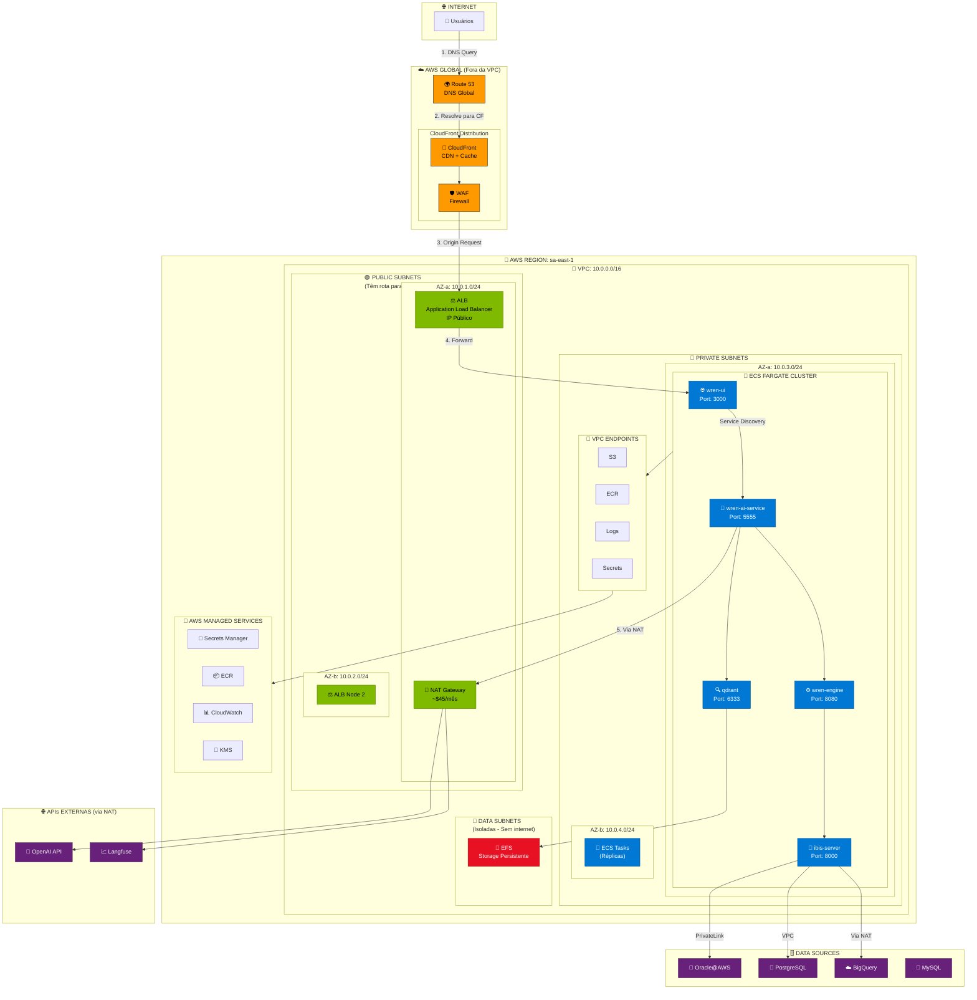

---

## O Que Fica em Cada Subnet?

### 📊 Diagrama: Componentes por Tipo de Subnet

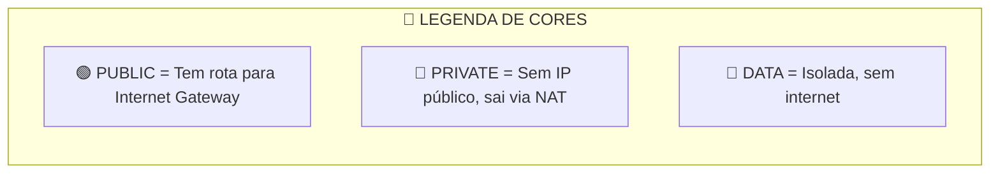

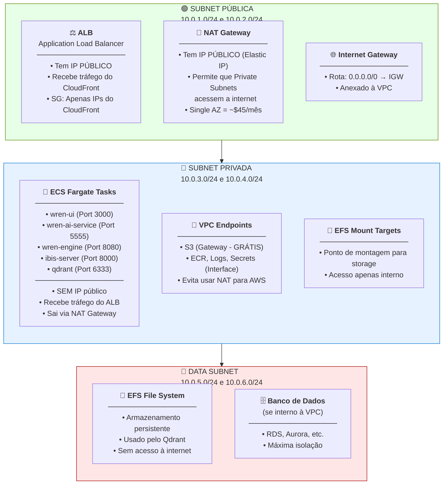

### 📋 Tabela Resumo: O Que Fica Onde?

| Subnet | Componente | Tem IP Público? | Acesso à Internet |
|--------|------------|-----------------|-------------------|
| **🟢 Pública** | ALB | ✅ Sim | ✅ Recebe (CloudFront) |
| **🟢 Pública** | NAT Gateway | ✅ Sim (EIP) | ✅ Permite saída |
| **🔵 Privada** | ECS Tasks | ❌ Não | ⬆️ Saída via NAT |
| **🔵 Privada** | VPC Endpoints | ❌ Não | 🔒 Privado (AWS) |
| **🔵 Privada** | EFS Mount | ❌ Não | ❌ Não |
| **🔴 Data** | EFS | ❌ Não | ❌ Não |
| **🔴 Data** | RDS (se houver) | ❌ Não | ❌ Não |

---

## Fluxo Passo a Passo

### 📊 Diagrama: Fluxo Completo de uma Requisição

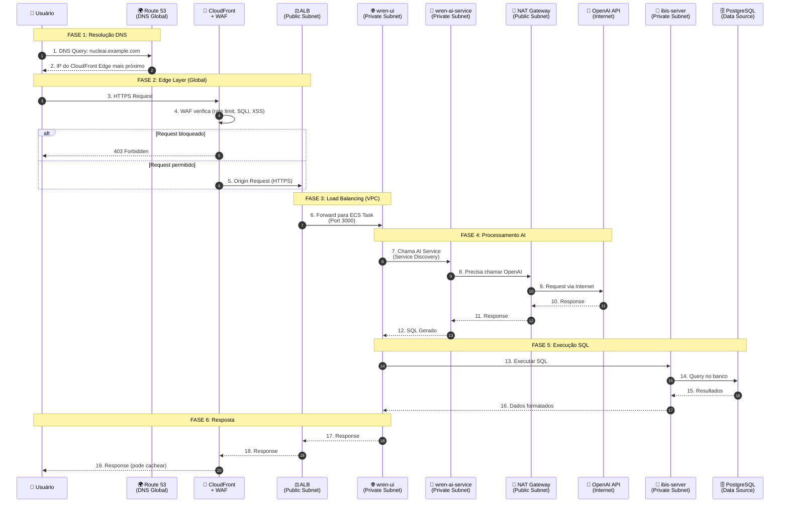

### 🚦 Explicação Passo a Passo

#### **FASE 1: Resolução DNS (Global)**

| Passo | Descrição | Onde Acontece |
|-------|-----------|---------------|
| 1 | Usuário digita `nucleai.example.com` no navegador | Cliente |
| 2 | Route 53 retorna o IP do CloudFront Edge mais próximo | Global |

#### **FASE 2: Edge Layer (Global - Fora da VPC)**

| Passo | Descrição | Onde Acontece |
|-------|-----------|---------------|
| 3 | Request HTTPS chega ao CloudFront | Edge Location |
| 4 | WAF verifica rate limit, SQL injection, XSS | Edge Location |
| 5 | Se aprovado, CloudFront faz Origin Request para ALB | Edge → VPC |

#### **FASE 3: Load Balancing (Dentro da VPC)**

| Passo | Descrição | Onde Acontece |
|-------|-----------|---------------|
| 6 | ALB recebe na **Public Subnet** e encaminha para ECS | VPC - Public → Private |

#### **FASE 4: Processamento AI (Private Subnet)**

| Passo | Descrição | Onde Acontece |
|-------|-----------|---------------|
| 7 | wren-ui chama wren-ai-service via Service Discovery | Private Subnet |
| 8-11 | AI service precisa chamar OpenAI, sai pelo **NAT Gateway** | Private → Public → Internet |
| 12 | AI retorna o SQL gerado | Private Subnet |

#### **FASE 5: Execução da Query (Private Subnet)**

| Passo | Descrição | Onde Acontece |
|-------|-----------|---------------|
| 13-16 | ibis-server conecta ao banco e executa a query | Private Subnet → Data Source |

#### **FASE 6: Resposta ao Usuário**

| Passo | Descrição | Onde Acontece |
|-------|-----------|---------------|
| 17-19 | Response volta pelo mesmo caminho | VPC → Edge → Cliente |

---

### 📊 Diagrama: Fluxo de Saída (ECS → Internet)

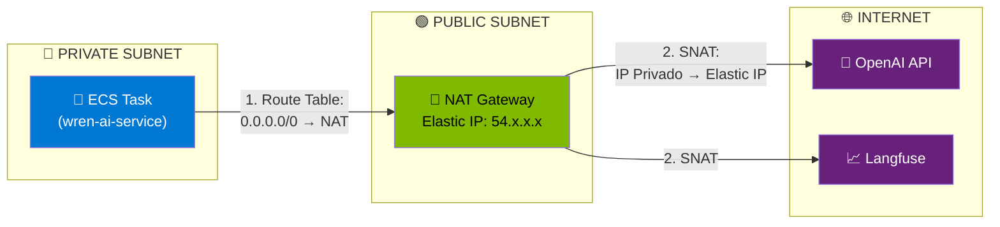

**Por que o NAT Gateway está na Public Subnet?**
- Precisa de IP público (Elastic IP) para fazer SNAT
- Route Table da Public Subnet: `0.0.0.0/0 → Internet Gateway`
- Route Table da Private Subnet: `0.0.0.0/0 → NAT Gateway`

---

### 📊 Diagrama: Fluxo para Serviços AWS (via VPC Endpoints)

```mermaid
flowchart LR
    subgraph PrivateSubnet["🔵 PRIVATE SUBNET"]
        ECS["🐳 ECS Task"]
        VPCE["📌 VPC Endpoints"]
    end

    subgraph AWSServices["🔧 AWS SERVICES (Regional)"]
        S3["📦 S3"]
        ECR["🐳 ECR"]
        Secrets["🔐 Secrets Manager"]
        Logs["📊 CloudWatch Logs"]
    end

    ECS -->|Tráfego Privado<br/>(não usa NAT)| VPCE
    VPCE --> S3
    VPCE --> ECR
    VPCE --> Secrets
    VPCE --> Logs

    style ECS fill:#0078d4,color:white
    style VPCE fill:#0078d4,color:white
    style S3 fill:#ff9900,color:black
    style ECR fill:#ff9900,color:black
```

**Economia**: VPC Endpoints evitam uso do NAT Gateway para serviços AWS = **menos custo**

---

## Estratégia de Rede (Cost-Optimized)

### ⚠️ Problema: NAT Gateway Custoso

Na v1, usávamos **2 NAT Gateways** (um por AZ), custando ~$90/mês.

### ✅ Solução: Single NAT Gateway + VPC Endpoints

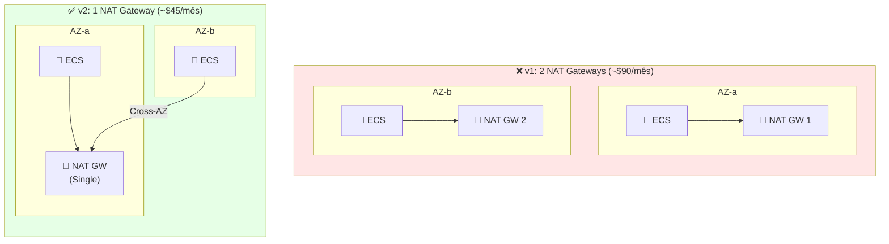

### VPC Endpoints: Eliminar Dependência do NAT

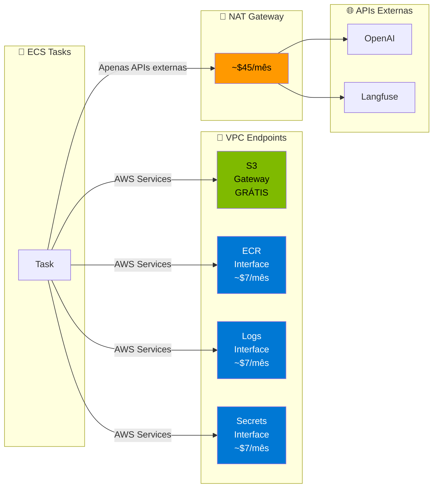

| Endpoint | Tipo | Custo | Finalidade |
|----------|------|-------|------------|
| **S3** | Gateway | **GRATUITO** | Backups, logs, artifacts |
| **ECR API** | Interface | ~$7/mês | Pull de imagens |
| **ECR DKR** | Interface | ~$7/mês | Docker registry |
| **CloudWatch Logs** | Interface | ~$7/mês | Envio de logs |
| **Secrets Manager** | Interface | ~$7/mês | Acesso a secrets |
| **EFS** | Interface | ~$7/mês | Mount points |

**Total VPC Endpoints**: ~$35/mês

**Uso do NAT Gateway (Single)**: Apenas para APIs externas (OpenAI, Langfuse, BigQuery, etc.)

---

## Componentes da Solução

### Classificação por Tipo de Workload

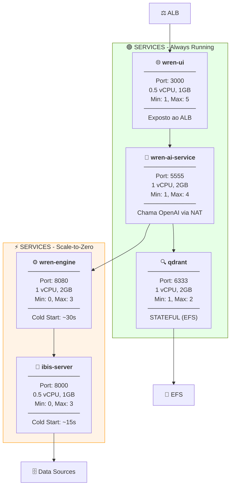

### Tabela de Componentes

| Componente | Tipo | Port | Recursos | Scaling | Justificativa |
|------------|------|------|----------|---------|---------------|
| `wren-ui` | Always Running | 3000 | 0.5 vCPU, 1GB | 1-5 | Frontend, SLA < 200ms |
| `wren-ai-service` | Always Running | 5555 | 1 vCPU, 2GB | 1-4 | NLP síncrono, chama OpenAI |
| `qdrant` | Stateful | 6333 | 1 vCPU, 2GB | 1-2 | Vector DB, requer EFS |
| `wren-engine` | Scale-to-Zero | 8080 | 1 vCPU, 2GB | 0-3 | Processa queries sob demanda |
| `ibis-server` | Scale-to-Zero | 8000 | 0.5 vCPU, 1GB | 0-3 | Conectores de dados |

> ⚠️ **Nota sobre Scale-to-Zero**: ECS Fargate não suporta nativamente. Use Application Auto Scaling com min=0 (cold start de ~30s) ou mantenha min=1 para latência garantida (~$20/mês extra).

---

## Fontes de Dados Suportadas

### 📊 Diagrama: Conectividade com Data Sources

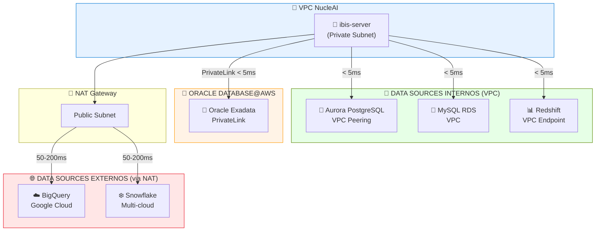

### Matriz Completa de Data Sources

| Categoria | Data Source | Conexão | Latência | Observações |
|-----------|-------------|---------|----------|-------------|
| **Enterprise** | Oracle Database@AWS | PrivateLink | <5ms | Full Oracle, Exadata |
| **Enterprise** | Oracle RDS | VPC | <5ms | Managed Oracle na AWS |
| **Cloud DW** | BigQuery | Internet (NAT) | 50-200ms | Google Cloud |
| **Cloud DW** | Snowflake | Internet (NAT) | 50-200ms | Multi-cloud |
| **Cloud DW** | Redshift | VPC | <5ms | AWS nativo |
| **Open Source** | PostgreSQL (Aurora) | VPC | <5ms | Serverless v2 |
| **Open Source** | MySQL (Aurora) | VPC | <5ms | Cost-effective |
| **Microsoft** | SQL Server (RDS) | VPC | <5ms | Enterprise |
| **Embedded** | DuckDB | Local (EFS) | <1ms | Analytics in-process |

### Oracle Database@AWS

**O que é**: Oracle Database rodando diretamente em infraestrutura AWS, com hardware Oracle dedicado (Exadata) e 100% compatibilidade.

**Benefícios**:
- ✅ Hardware dedicado Oracle (Exadata)
- ✅ 100% compatibilidade com Oracle on-premise
- ✅ Features avançados: RAC, Data Guard, RMAN
- ✅ Conectividade via AWS PrivateLink (<5ms)

**Configuração no ibis-server**:

```yaml
connection:
  type: oracle
  host: oracle-odb.xxxxx.sa-east-1.aws.oracle.com
  port: 1521
  service_name: ORCL
  credentials:
    username: ${ORACLE_USER}
    password: ${ORACLE_PASSWORD}  # via Secrets Manager
```

---

## Segurança

### Modelo de Segurança em Camadas

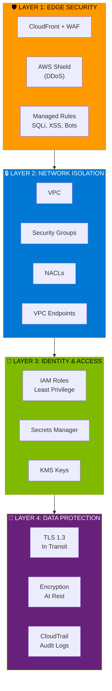

### Security Groups (Fluxo)

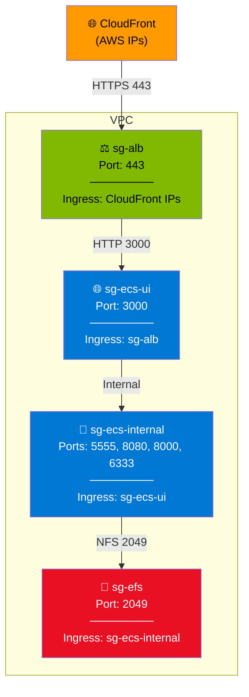

### Tabela de Security Groups

| Security Group | Porta | Ingress | Descrição |
|----------------|-------|---------|-----------|
| `sg-alb` | 443 | CloudFront Prefix List | ALB aceita apenas CloudFront |
| `sg-ecs-ui` | 3000 | sg-alb | wren-ui recebe do ALB |
| `sg-ecs-internal` | 5555, 8080, 8000, 6333 | sg-ecs-ui | Services internos |
| `sg-efs` | 2049 | sg-ecs-internal | EFS aceita apenas ECS |

---

## Estimativa de Custos

### Comparação v1 vs v2

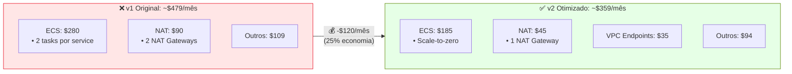

### Detalhamento v2 (Otimizado)

| Componente | Configuração | Custo/Mês | Notas |
|------------|--------------|-----------|-------|
| **ECS Fargate** | | | |
| └ wren-ui | 0.5 vCPU, 1GB, avg 1.5 tasks | ~$25 | Always running |
| └ wren-ai-service | 1 vCPU, 2GB, avg 1.5 tasks | ~$55 | Always running |
| └ wren-engine | 1 vCPU, 2GB, avg 1 task | ~$35 | Scale on demand |
| └ ibis-server | 0.5 vCPU, 1GB, avg 1 task | ~$20 | Scale on demand |
| └ qdrant | 1 vCPU, 2GB, 1 task | ~$50 | Stateful |
| **Rede** | | | |
| └ NAT Gateway | 1x (single AZ) | ~$45 | External APIs only |
| └ VPC Endpoints | 5 interface endpoints | ~$35 | AWS services |
| └ Data Transfer | ~50GB | ~$10 | Cross-AZ + external |
| **Load Balancer** | | | |
| └ ALB | 1 ALB, multi-AZ | ~$25 | Fixed cost |
| **Storage** | | | |
| └ EFS | 50GB, IA enabled | ~$15 | Qdrant persistence |
| **Observability** | | | |
| └ CloudWatch | Logs + Metrics | ~$15 | Optimized retention |
| **Edge** | | | |
| └ CloudFront | 100GB transfer | ~$15 | CDN + Cache |
| └ Route 53 | 1 hosted zone | ~$5 | DNS |
| └ WAF | 3 managed rules | ~$5 | Security |
| **Security** | | | |
| └ Secrets Manager | 5 secrets | ~$2 | API keys |
| └ ACM | 1 certificate | ~$0 | Free with CloudFront |
| └ ECR | 10GB images | ~$2 | Container registry |
| | | | |
| **TOTAL** | | **~$359/mês** | |

---

## Changelog

### v1 → v2.1

| Aspecto | v1 (Original) | v2.1 (Revisado) | Impacto |
|---------|---------------|-----------------|---------|
| **NAT Gateway** | 2 (dual-AZ) | 1 (single-AZ) + VPC Endpoints | -$45/mês |
| **Edge Layer** | Route53 → CloudFront → WAF | Route53 → CloudFront+WAF | Correção conceitual |
| **wren-ui** | Service (min 2) | Service (min 1, ALB exposed) | Clareza, -$10/mês |
| **wren-engine** | Service (min 2) | Service (min 0, scale-to-zero) | -$35/mês |
| **ibis-server** | Service (min 2) | Service (min 0, scale-to-zero) | -$15/mês |
| **qdrant** | Service | Service (stateful, EFS) | Clareza |
| **Oracle@AWS** | Não mencionado | Adicionado como data source | Feature |
| **Diagramas** | ASCII Art | Mermaid | Melhor visualização |
| **Custo Total** | ~$479/mês | ~$359/mês | **-25%** |

---

## Próximos Passos

1. ✅ **Arquitetura Revisada** - Documentação atualizada com Mermaid
2. ⏳ **Atualizar Terraform** - Single NAT + VPC Endpoints
3. ⏳ **Configurar Scale-to-Zero** - wren-engine e ibis-server
4. ⏳ **Testar Oracle@AWS** - Conectividade via PrivateLink
5. ⏳ **Validar Cold Start** - Tempo aceitável para scale-to-zero

---

## Referências

- [Oracle Database@AWS](https://www.oracle.com/cloud/aws/)
- [VPC Endpoints Pricing](https://aws.amazon.com/privatelink/pricing/)
- [ECS Fargate Pricing](https://aws.amazon.com/fargate/pricing/)
- [NAT Gateway Best Practices](https://docs.aws.amazon.com/vpc/latest/userguide/vpc-nat-gateway.html)
- [CloudFront + WAF Integration](https://docs.aws.amazon.com/waf/latest/developerguide/cloudfront-features.html)
- [ECS Application Auto Scaling](https://docs.aws.amazon.com/AmazonECS/latest/developerguide/service-auto-scaling.html)
