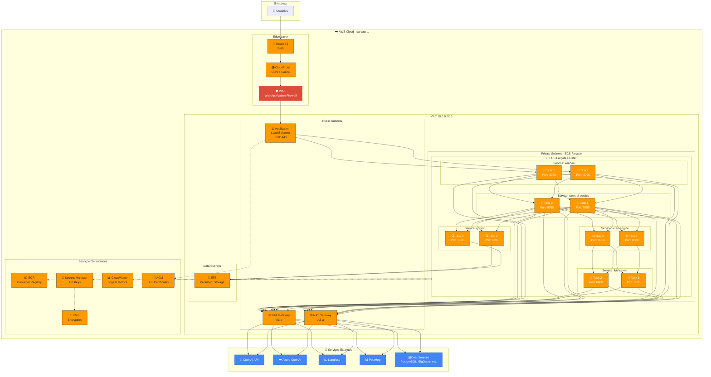
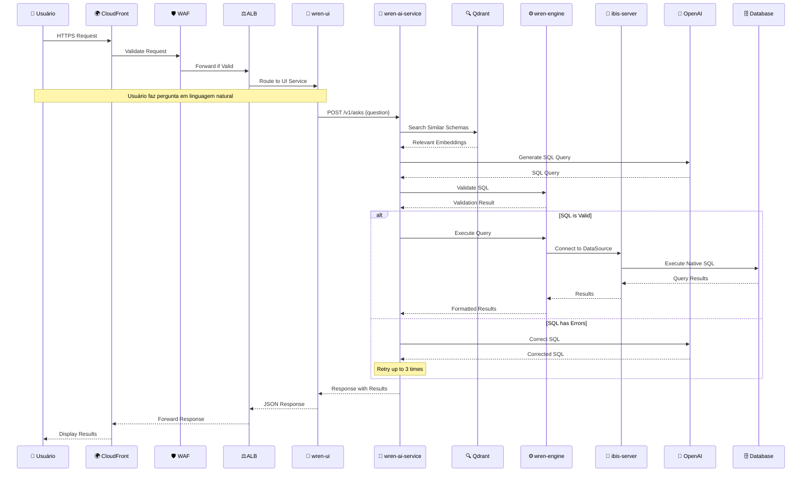
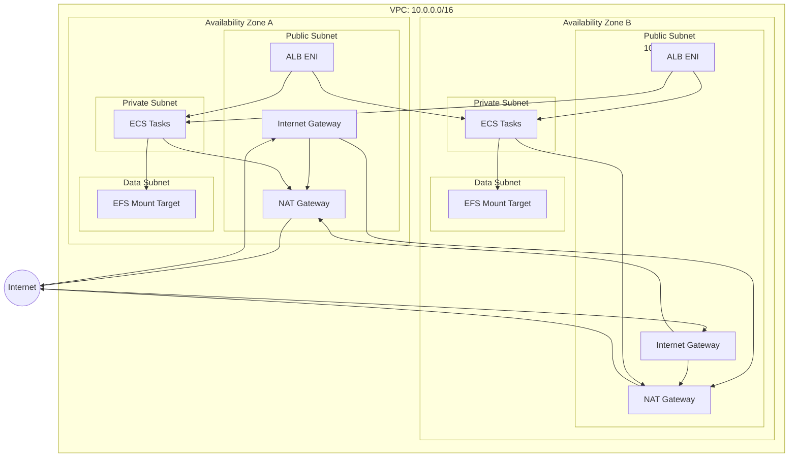
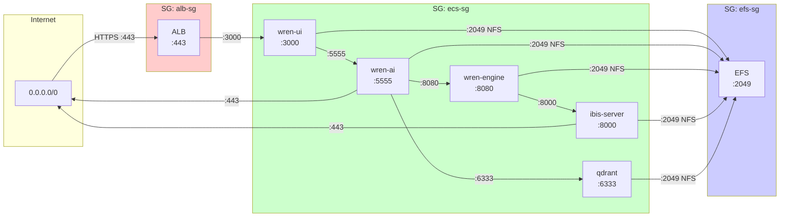
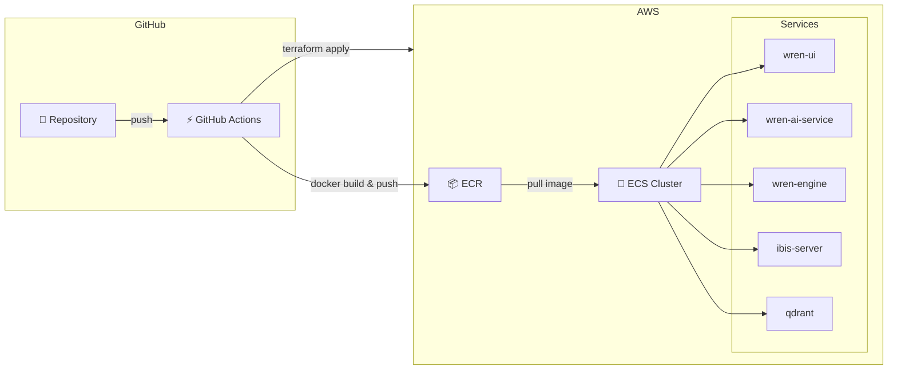
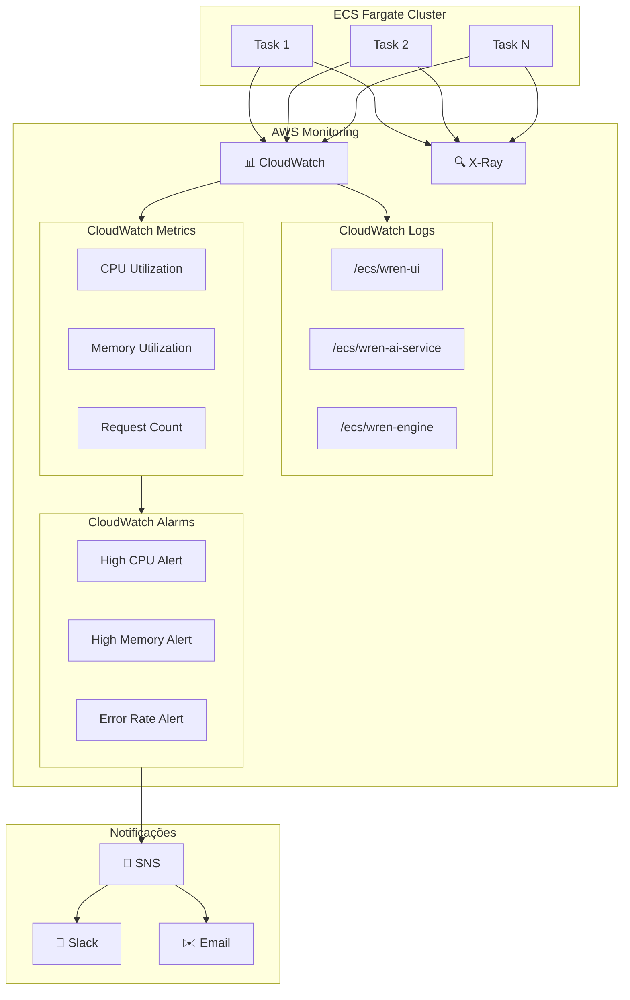
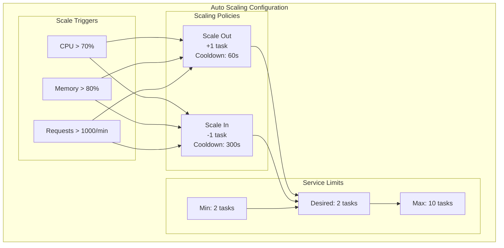
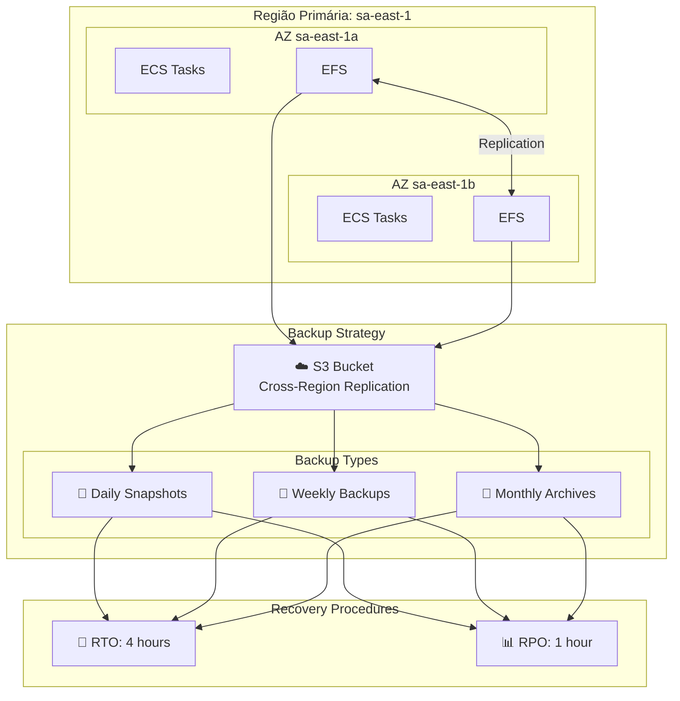

# 🏗️ Arquitetura NucleAI - AWS ECS Fargate

## 📋 Índice

1. [Visão Geral](#visão-geral)
2. [Diagrama de Arquitetura](#diagrama-de-arquitetura)
3. [Componentes da Solução](#componentes-da-solução)
4. [Fluxo de Dados](#fluxo-de-dados)
5. [Infraestrutura AWS](#infraestrutura-aws)
6. [Segurança](#segurança)
7. [Estimativa de Custos](#estimativa-de-custos)
8. [Implementação](#implementação)

---

## Visão Geral

O **NucleAI** é uma plataforma de Text-to-SQL com IA que permite análise de dados através de linguagem natural. Esta arquitetura foi projetada para AWS ECS Fargate, oferecendo:

- ✅ **Serverless**: Sem gerenciamento de servidores
- ✅ **Escalabilidade Automática**: Auto-scaling baseado em métricas
- ✅ **Alta Disponibilidade**: Multi-AZ com failover automático
- ✅ **Segurança**: VPC isolada, secrets gerenciados, TLS end-to-end
- ✅ **Observabilidade**: Logs centralizados, métricas e tracing

### Microserviços do Sistema

| Serviço | Descrição | Porta |
|---------|-----------|-------|
| `wren-ui` | Interface Web (Next.js) | 3000 |
| `wren-ai-service` | Serviço de IA/LLM (Python) | 5555 |
| `wren-engine` | Motor de Processamento SQL | 8080 |
| `ibis-server` | Servidor Ibis para conectores | 8000 |
| `qdrant` | Vector Database | 6333/6334 |
| `bootstrap` | Inicialização e Migração | - |

---

## Diagrama de Arquitetura

```
┌─────────────────────────────────────────────────────────────────────────────────────────────────────────────────┐
│                                              AWS CLOUD                                                          │
│  ┌──────────────────────────────────────────────────────────────────────────────────────────────────────────┐   │
│  │                                           REGION: sa-east-1 (São Paulo)                                  │   │
│  │                                                                                                          │   │
│  │   ┌─────────────────┐                                                                                    │   │
│  │   │   Route 53      │◄──── DNS: nucleai.example.com                                                      │   │
│  │   │   (DNS)         │                                                                                    │   │
│  │   └────────┬────────┘                                                                                    │   │
│  │            │                                                                                             │   │
│  │            ▼                                                                                             │   │
│  │   ┌─────────────────┐         ┌─────────────────────────────────────────────────────────────────────┐    │   │
│  │   │   CloudFront    │         │                        VPC: 10.0.0.0/16                             │    │   │
│  │   │   (CDN + WAF)   │────────►│                                                                     │    │   │
│  │   └─────────────────┘         │  ┌────────────────────────────────────────────────────────────┐     │    │   │
│  │                               │  │                    PUBLIC SUBNETS                          │     │    │   │
│  │                               │  │                                                            │     │    │   │
│  │                               │  │   ┌────────────────┐        ┌────────────────┐             │     │    │   │
│  │                               │  │   │  AZ-a          │        │  AZ-b          │             │     │    │   │
│  │                               │  │   │  10.0.1.0/24   │        │  10.0.2.0/24   │             │     │    │   │
│  │                               │  │   │                │        │                │             │     │    │   │
│  │                               │  │   │ ┌────────────┐ │        │ ┌────────────┐ │             │     │    │   │
│  │                               │  │   │ │ NAT        │ │        │ │ NAT        │ │             │     │    │   │
│  │                               │  │   │ │ Gateway    │ │        │ │ Gateway    │ │             │     │    │   │
│  │                               │  │   │ └────────────┘ │        │ └────────────┘ │             │     │    │   │
│  │                               │  │   └────────────────┘        └────────────────┘             │     │    │   │
│  │                               │  │                                                            │     │    │   │
│  │                               │  │                    ┌────────────────┐                      │     │    │   │
│  │                               │  │                    │    ALB         │                      │     │    │   │
│  │                               │  │                    │  (Application  │                      │     │    │   │
│  │                               │  │                    │ Load Balancer) │                      │     │    │   │
│  │                               │  │                    │  Port: 443     │                      │     │    │   │
│  │                               │  │                    └───────┬────────┘                      │     │    │   │
│  │                               │  └────────────────────────────┼───────────────────────────────┘     │    │   │
│  │                               │                               │                                     │    │   │
│  │                               │  ┌────────────────────────────┼───────────────────────────────┐     │    │   │
│  │                               │  │                    PRIVATE SUBNETS                         │     │    │   │
│  │                               │  │                            │                               │     │    │   │
│  │                               │  │   ┌────────────────────────┴────────────────────────┐      │     │    │   │
│  │                               │  │   │            ECS FARGATE CLUSTER                  │      │     │    │   │
│  │                               │  │   │                                                 │      │     │    │   │
│  │                               │  │   │  ┌─────────────────────────────────────────┐    │      │     │    │   │
│  │                               │  │   │  │         SERVICE: wren-ui                │    │      │     │    │   │
│  │                               │  │   │  │  ┌─────────────┐   ┌─────────────┐       │    │      │     │    │   │
│  │                               │  │   │  │  │   Task 1    │   │   Task 2    │       │    │      │     │    │   │
│  │                               │  │   │  │  │   (AZ-a)    │   │   (AZ-b)    │       │    │      │     │    │   │
│  │                               │  │   │  │  │ Port: 3000  │   │ Port: 3000  │       │    │      │     │    │   │
│  │                               │  │   │  │  └─────────────┘   └─────────────┘       │    │      │     │    │   │
│  │                               │  │   │  └─────────────────────────────────────────┘    │      │     │    │   │
│  │                               │  │   │                         │                       │      │     │    │   │
│  │                               │  │   │  ┌─────────────────────────────────────────┐    │      │     │    │   │
│  │                               │  │   │  │      SERVICE: wren-ai-service           │    │      │     │    │   │
│  │                               │  │   │  │  ┌─────────────┐   ┌─────────────┐       │    │      │     │    │   │
│  │                               │  │   │  │  │   Task 1    │   │   Task 2    │       │    │      │     │    │   │
│  │                               │  │   │  │  │   (AZ-a)    │   │   (AZ-b)    │       │    │      │     │    │   │
│  │                               │  │   │  │  │ Port: 5555  │   │ Port: 5555  │       │    │      │     │    │   │
│  │                               │  │   │  │  └─────────────┘   └─────────────┘       │    │      │     │    │   │
│  │                               │  │   │  └─────────────────────────────────────────┘    │      │     │    │   │
│  │                               │  │   │                         │                       │      │     │    │   │
│  │                               │  │   │  ┌─────────────────────────────────────────┐    │      │     │    │   │
│  │                               │  │   │  │       SERVICE: wren-engine              │    │      │     │    │   │
│  │                               │  │   │  │  ┌─────────────┐   ┌─────────────┐       │    │      │     │    │   │
│  │                               │  │   │  │  │   Task 1    │   │   Task 2    │       │    │      │     │    │   │
│  │                               │  │   │  │  │   (AZ-a)    │   │   (AZ-b)    │       │    │      │     │    │   │
│  │                               │  │   │  │  │ Port: 8080  │   │ Port: 8080  │       │    │      │     │    │   │
│  │                               │  │   │  │  └─────────────┘   └─────────────┘       │    │      │     │    │   │
│  │                               │  │   │  └─────────────────────────────────────────┘    │      │     │    │   │
│  │                               │  │   │                         │                       │      │     │    │   │
│  │                               │  │   │  ┌─────────────────────────────────────────┐    │      │     │    │   │
│  │                               │  │   │  │        SERVICE: ibis-server             │    │      │     │    │   │
│  │                               │  │   │  │  ┌─────────────┐   ┌─────────────┐       │    │      │     │    │   │
│  │                               │  │   │  │  │   Task 1    │   │   Task 2    │       │    │      │     │    │   │
│  │                               │  │   │  │  │   (AZ-a)    │   │   (AZ-b)    │       │    │      │     │    │   │
│  │                               │  │   │  │  │ Port: 8000  │   │ Port: 8000  │       │    │      │     │    │   │
│  │                               │  │   │  │  └─────────────┘   └─────────────┘       │    │      │     │    │   │
│  │                               │  │   │  └─────────────────────────────────────────┘    │      │     │    │   │
│  │                               │  │   │                         │                       │      │     │    │   │
│  │                               │  │   │  ┌─────────────────────────────────────────┐    │      │     │    │   │
│  │                               │  │   │  │          SERVICE: qdrant                │    │      │     │    │   │
│  │                               │  │   │  │  ┌─────────────┐   ┌─────────────┐       │    │      │     │    │   │
│  │                               │  │   │  │  │   Task 1    │   │   Task 2    │       │    │      │     │    │   │
│  │                               │  │   │  │  │   (AZ-a)    │   │   (AZ-b)    │       │    │      │     │    │   │
│  │                               │  │   │  │  │ Port: 6333  │   │ Port: 6333  │       │    │      │     │    │   │
│  │                               │  │   │  │  └─────────────┘   └─────────────┘       │    │      │     │    │   │
│  │                               │  │   │  └─────────────────────────────────────────┘    │      │     │    │   │
│  │                               │  │   │                                                 │      │     │    │   │
│  │                               │  │   └─────────────────────────────────────────────────┘      │     │    │   │
│  │                               │  │                                                            │     │    │   │
│  │                               │  │   ┌─────────────────┐              ┌─────────────────┐     │     │    │   │
│  │                               │  │   │  AZ-a           │              │  AZ-b           │     │     │    │   │
│  │                               │  │   │  10.0.3.0/24    │              │  10.0.4.0/24    │     │     │    │   │
│  │                               │  │   └─────────────────┘              └─────────────────┘     │     │    │   │
│  │                               │  └────────────────────────────────────────────────────────────┘     │    │   │
│  │                               │                                                                     │    │   │
│  │                               │  ┌────────────────────────────────────────────────────────────┐     │    │   │
│  │                               │  │                    DATA SUBNETS                            │     │    │   │
│  │                               │  │                                                            │     │    │   │
│  │                               │  │   ┌─────────────────┐              ┌─────────────────┐     │     │    │   │
│  │                               │  │   │  AZ-a           │              │  AZ-b           │     │     │    │   │
│  │                               │  │   │  10.0.5.0/24    │              │  10.0.6.0/24    │     │     │    │   │
│  │                               │  │   │                 │              │                 │     │     │    │   │
│  │                               │  │   │ ┌─────────────┐ │              │ ┌─────────────┐ │     │     │    │   │
│  │                               │  │   │ │   EFS       │◄┼──────────────┼►│   EFS       │ │     │     │    │   │
│  │                               │  │   │ │ Mount Point │ │  Replicação  │ │ Mount Point │ │     │     │    │   │
│  │                               │  │   │ └─────────────┘ │              │ └─────────────┘ │     │     │    │   │
│  │                               │  │   └─────────────────┘              └─────────────────┘     │     │    │   │
│  │                               │  └────────────────────────────────────────────────────────────┘     │    │   │
│  │                               └─────────────────────────────────────────────────────────────────────┘    │   │
│  │                                                                                                          │   │
│  │   ┌──────────────────────────────────────────────────────────────────────────────────────────────────┐   │   │
│  │   │                                    SERVIÇOS GERENCIADOS AWS                                      │   │   │
│  │   │                                                                                                  │   │   │
│  │   │  ┌─────────────┐  ┌─────────────┐  ┌─────────────┐  ┌─────────────┐  ┌─────────────┐              │   │   │
│  │   │  │   Secrets   │  │    ECR      │  │ CloudWatch  │  │  X-Ray      │  │   ACM       │              │   │   │
│  │   │  │   Manager   │  │ (Registry)  │  │ (Logs +     │  │ (Tracing)   │  │ (Cert SSL)  │              │   │   │
│  │   │  │             │  │             │  │  Metrics)   │  │             │  │             │              │   │   │
│  │   │  └─────────────┘  └─────────────┘  └─────────────┘  └─────────────┘  └─────────────┘              │   │   │
│  │   │                                                                                                  │   │   │
│  │   │  ┌─────────────┐  ┌─────────────┐  ┌─────────────┐  ┌─────────────┐  ┌─────────────┐              │   │   │
│  │   │  │    EFS      │  │    S3       │  │   Systems   │  │   IAM       │  │   KMS       │              │   │   │
│  │   │  │ (Storage)   │  │ (Backups)   │  │   Manager   │  │ (Roles)     │  │ (Encrypt)   │              │   │   │
│  │   │  └─────────────┘  └─────────────┘  └─────────────┘  └─────────────┘  └─────────────┘              │   │   │
│  │   └──────────────────────────────────────────────────────────────────────────────────────────────────┘   │   │
│  │                                                                                                          │   │
│  └──────────────────────────────────────────────────────────────────────────────────────────────────────────┘   │
│                                                                                                                 │
│   ┌─────────────────────────────────────────────────────────────────────────────────────────────────────────┐   │
│   │                                       INTEGRAÇÕES EXTERNAS                                              │   │
│   │                                                                                                         │   │
│   │  ┌─────────────┐  ┌─────────────┐  ┌─────────────┐  ┌─────────────┐  ┌─────────────┐                    │   │
│   │  │   OpenAI    │  │   Azure     │  │  Langfuse   │  │  PostHog    │  │  Data       │                    │   │
│   │  │   API       │  │   OpenAI    │  │ (Observab.) │  │ (Analytics) │  │  Sources    │                    │   │
│   │  │             │  │   Service   │  │             │  │             │  │(PostgreSQL, │                    │   │
│   │  │             │  │             │  │             │  │             │  │ BigQuery,   │                    │   │
│   │  │             │  │             │  │             │  │             │  │ etc.)       │                    │   │
│   │  └─────────────┘  └─────────────┘  └─────────────┘  └─────────────┘  └─────────────┘                    │   │
│   └─────────────────────────────────────────────────────────────────────────────────────────────────────────┘   │
│                                                                                                                 │
└─────────────────────────────────────────────────────────────────────────────────────────────────────────────────┘
```

---

## Componentes da Solução

### 1. **Wren UI** (Frontend)
```yaml
Tecnologia: Next.js / React
Imagem: ghcr.io/canner/wren-ui
Porta: 3000
Recursos:
  CPU: 512 (0.5 vCPU)
  Memória: 1024 MB
Responsabilidades:
  - Interface web para usuários
  - Gerenciamento de projetos
  - Visualização de queries
  - Telemetria (PostHog)
```

### 2. **Wren AI Service** (Backend AI)
```yaml
Tecnologia: Python / FastAPI
Imagem: ghcr.io/canner/wren-ai-service
Porta: 5555
Recursos:
  CPU: 1024 (1 vCPU)
  Memória: 2048 MB
Responsabilidades:
  - Processamento de linguagem natural
  - Geração de SQL via LLM
  - Indexação e retrieval de schemas
  - Integração com OpenAI/Azure OpenAI
```

### 3. **Wren Engine** (Motor SQL)
```yaml
Tecnologia: Java / Rust
Imagem: ghcr.io/canner/wren-engine
Porta: 8080
Recursos:
  CPU: 1024 (1 vCPU)
  Memória: 2048 MB
Responsabilidades:
  - Processamento de queries SQL
  - Validação de sintaxe
  - Otimização de consultas
```

### 4. **Ibis Server** (Conectores)
```yaml
Tecnologia: Python / Ibis
Imagem: ghcr.io/canner/wren-engine-ibis
Porta: 8000
Recursos:
  CPU: 512 (0.5 vCPU)
  Memória: 1024 MB
Responsabilidades:
  - Conexão com fontes de dados
  - Tradução de queries para dialetos SQL
  - Suporte a múltiplos databases
```

### 5. **Qdrant** (Vector Database)
```yaml
Tecnologia: Rust / Qdrant
Imagem: qdrant/qdrant:v1.11.0
Porta: 6333/6334
Recursos:
  CPU: 1024 (1 vCPU)
  Memória: 2048 MB
Responsabilidades:
  - Armazenamento de embeddings
  - Busca semântica
  - Indexação de schemas
```

---

## Fluxo de Dados

```
┌───────────────────────────────────────────────────────────────────────────────────────┐
│                              FLUXO DE REQUISIÇÃO                                      │
└───────────────────────────────────────────────────────────────────────────────────────┘

    ┌──────────┐
    │  Usuário │
    │  Browser │
    └────┬─────┘
         │
         │ HTTPS (443)
         ▼
    ┌──────────┐     ┌──────────┐
    │CloudFront│────►│   WAF    │ ◄── Proteção DDoS, Rate Limiting
    └────┬─────┘     └──────────┘
         │
         ▼
    ┌──────────┐
    │   ALB    │ ◄── TLS Termination, Health Checks
    └────┬─────┘
         │
         │ HTTP (3000)
         ▼
    ┌──────────────┐
    │   wren-ui    │ ◄── Renderização, Sessão, UI
    └────┬─────────┘
         │
         │ HTTP (5555)  ← Consultas em linguagem natural
         ▼
    ┌──────────────────┐
    │ wren-ai-service  │
    │                  │◄─────┐
    │ ┌──────────────┐ │      │
    │ │   LLM API    │─┼──────┼──► OpenAI / Azure OpenAI
    │ └──────────────┘ │      │
    │                  │      │
    │ ┌──────────────┐ │      │
    │ │  Embeddings  │─┼──────┘
    │ └──────────────┘ │
    └────┬─────────────┘
         │
         │ HTTP (6333) ← Busca vetorial
         ▼
    ┌──────────────┐
    │    qdrant    │ ◄── Vector similarity search
    └──────────────┘
         ▲
         │ Indexação de schemas
         │
    ┌────┴─────────┐
    │              │
    ▼              ▼
┌──────────┐  ┌──────────────┐
│  wren-   │  │ ibis-server  │
│  engine  │  │              │
│  (8080)  │  │    (8000)    │
└────┬─────┘  └──────┬───────┘
     │               │
     │               │ Conexão com fontes de dados
     │               ▼
     │         ┌──────────────────────────────────────┐
     │         │         FONTES DE DADOS               │
     │         │                                       │
     │         │  ┌───────┐ ┌───────┐ ┌───────┐       │
     │         │  │ Post  │ │  Big  │ │ MySQL │       │
     │         │  │greSQL │ │ Query │ │       │ ...   │
     │         │  └───────┘ └───────┘ └───────┘       │
     │         └──────────────────────────────────────┘
     │
     ▼
┌──────────────┐
│     EFS      │ ◄── Persistência de dados locais
│  (Storage)   │
└──────────────┘
```

---

## Infraestrutura AWS

### Rede (VPC)

| Componente | CIDR | Propósito |
|------------|------|-----------|
| VPC | 10.0.0.0/16 | Rede principal |
| Public Subnet AZ-a | 10.0.1.0/24 | NAT Gateway, ALB |
| Public Subnet AZ-b | 10.0.2.0/24 | NAT Gateway, ALB |
| Private Subnet AZ-a | 10.0.3.0/24 | ECS Tasks |
| Private Subnet AZ-b | 10.0.4.0/24 | ECS Tasks |
| Data Subnet AZ-a | 10.0.5.0/24 | EFS Mount |
| Data Subnet AZ-b | 10.0.6.0/24 | EFS Mount |

### ECS Fargate - Configuração de Serviços

| Serviço | Tasks Mín | Tasks Máx | vCPU | Memória | Health Check |
|---------|-----------|-----------|------|---------|--------------|
| wren-ui | 2 | 10 | 0.5 | 1GB | /api/health |
| wren-ai-service | 2 | 8 | 1.0 | 2GB | /health |
| wren-engine | 2 | 6 | 1.0 | 2GB | /health |
| ibis-server | 2 | 4 | 0.5 | 1GB | /health |
| qdrant | 2 | 4 | 1.0 | 2GB | /health |

### Auto Scaling Policies

```yaml
Target Tracking:
  - Métrica: CPUUtilization
    Target: 70%
    Scale-out cooldown: 60s
    Scale-in cooldown: 300s

  - Métrica: MemoryUtilization
    Target: 80%
    Scale-out cooldown: 60s
    Scale-in cooldown: 300s

  - Métrica: ALBRequestCountPerTarget
    Target: 1000 req/min
    Scale-out cooldown: 30s
    Scale-in cooldown: 300s
```

---

## Segurança

### Modelo de Segurança em Camadas

```
┌─────────────────────────────────────────────────────────────────┐
│                     CAMADA 1: EDGE                              │
│  ┌─────────────────────────────────────────────────────────┐    │
│  │  CloudFront + WAF                                       │    │
│  │  • Rate Limiting (1000 req/5min por IP)                 │    │
│  │  • Geo-blocking (opcional)                              │    │
│  │  • SQL Injection Protection                             │    │
│  │  • XSS Protection                                       │    │
│  │  • Bot Detection                                        │    │
│  └─────────────────────────────────────────────────────────┘    │
└─────────────────────────────────────────────────────────────────┘

┌─────────────────────────────────────────────────────────────────┐
│                     CAMADA 2: TRANSPORTE                        │
│  ┌─────────────────────────────────────────────────────────┐    │
│  │  TLS/SSL                                                │    │
│  │  • ACM Certificate (*.nucleai.example.com)              │    │
│  │  • TLS 1.3 obrigatório                                  │    │
│  │  • HSTS habilitado                                      │    │
│  └─────────────────────────────────────────────────────────┘    │
└─────────────────────────────────────────────────────────────────┘

┌─────────────────────────────────────────────────────────────────┐
│                     CAMADA 3: REDE                              │
│  ┌─────────────────────────────────────────────────────────┐    │
│  │  Security Groups                                        │    │
│  │  • ALB-SG: Ingress 443 de 0.0.0.0/0                     │    │
│  │  • ECS-SG: Ingress apenas de ALB-SG                     │    │
│  │  • EFS-SG: Ingress 2049 apenas de ECS-SG                │    │
│  │  • Qdrant-SG: Ingress 6333-6334 apenas de ECS-SG        │    │
│  └─────────────────────────────────────────────────────────┘    │
└─────────────────────────────────────────────────────────────────┘

┌─────────────────────────────────────────────────────────────────┐
│                     CAMADA 4: APLICAÇÃO                         │
│  ┌─────────────────────────────────────────────────────────┐    │
│  │  IAM Roles & Policies                                   │    │
│  │  • ECS Task Role: Acesso mínimo necessário              │    │
│  │  • ECS Execution Role: ECR, CloudWatch Logs             │    │
│  │  • Service-linked roles para cada componente            │    │
│  └─────────────────────────────────────────────────────────┘    │
└─────────────────────────────────────────────────────────────────┘

┌─────────────────────────────────────────────────────────────────┐
│                     CAMADA 5: DADOS                             │
│  ┌─────────────────────────────────────────────────────────┐    │
│  │  Secrets Management                                     │    │
│  │  • AWS Secrets Manager para API keys                    │    │
│  │  • KMS para criptografia at-rest                        │    │
│  │  • Parameter Store para configs não-sensíveis           │    │
│  │  • EFS criptografado com KMS                            │    │
│  └─────────────────────────────────────────────────────────┘    │
└─────────────────────────────────────────────────────────────────┘
```

### Security Groups

```hcl
# ALB Security Group
alb_security_group:
  ingress:
    - port: 443
      source: 0.0.0.0/0
      description: "HTTPS from Internet"
  egress:
    - port: all
      destination: ecs_security_group
      description: "To ECS Tasks"

# ECS Security Group
ecs_security_group:
  ingress:
    - port: 3000
      source: alb_security_group
      description: "wren-ui from ALB"
    - port: 5555
      source: ecs_security_group
      description: "wren-ai-service internal"
    - port: 8080
      source: ecs_security_group
      description: "wren-engine internal"
    - port: 8000
      source: ecs_security_group
      description: "ibis-server internal"
    - port: 6333-6334
      source: ecs_security_group
      description: "qdrant internal"
  egress:
    - port: 443
      destination: 0.0.0.0/0
      description: "HTTPS to Internet (APIs)"
    - port: 2049
      destination: efs_security_group
      description: "NFS to EFS"
```

---

## Estimativa de Custos

### Custos Mensais Estimados (Região: sa-east-1)

| Componente | Especificação | Custo Estimado/Mês |
|------------|---------------|-------------------|
| **ECS Fargate** | | |
| - wren-ui | 2 tasks × 0.5 vCPU × 1GB × 730h | ~$35 |
| - wren-ai-service | 2 tasks × 1 vCPU × 2GB × 730h | ~$70 |
| - wren-engine | 2 tasks × 1 vCPU × 2GB × 730h | ~$70 |
| - ibis-server | 2 tasks × 0.5 vCPU × 1GB × 730h | ~$35 |
| - qdrant | 2 tasks × 1 vCPU × 2GB × 730h | ~$70 |
| **ALB** | Application Load Balancer | ~$25 |
| **NAT Gateway** | 2 × NAT Gateway + Data Transfer | ~$90 |
| **EFS** | 50GB Standard + IA | ~$15 |
| **CloudWatch** | Logs + Metrics | ~$20 |
| **Secrets Manager** | 5 secrets | ~$3 |
| **CloudFront** | 100GB transfer | ~$15 |
| **Route 53** | Hosted Zone + Queries | ~$5 |
| **ECR** | 10GB images | ~$1 |
| | | |
| **TOTAL ESTIMADO** | | **~$454/mês** |

### Custos Variáveis (OpenAI)

| Modelo | Preço Input | Preço Output | Estimativa (10k queries/mês) |
|--------|-------------|--------------|------------------------------|
| GPT-4.1 Nano | $0.10/1M tokens | $0.40/1M tokens | ~$50 |
| GPT-4.1 Mini | $0.40/1M tokens | $1.60/1M tokens | ~$200 |
| text-embedding-3-large | $0.13/1M tokens | - | ~$30 |

---

## Implementação

A implementação completa está disponível nos seguintes diretórios:

```
docs/architecture/
├── README.md                    # Este documento
├── ARCHITECTURE_DIAGRAM.md      # Diagrama detalhado em ASCII/Mermaid
├── terraform/                   # Infraestrutura como Código
│   ├── main.tf
│   ├── variables.tf
│   ├── outputs.tf
│   ├── vpc.tf
│   ├── ecs.tf
│   ├── alb.tf
│   ├── efs.tf
│   ├── security.tf
│   └── modules/
└── ecs-task-definitions/        # Definições de Tasks
    ├── wren-ui.json
    ├── wren-ai-service.json
    ├── wren-engine.json
    ├── ibis-server.json
    └── qdrant.json
```

---

## Próximos Passos

1. **Fase 1 - Preparação** (1 semana)
   - [ ] Criar conta AWS e configurar billing alerts
   - [ ] Configurar AWS CLI e Terraform
   - [ ] Criar repositórios ECR
   - [ ] Configurar Secrets Manager

2. **Fase 2 - Infraestrutura Base** (1 semana)
   - [ ] Deploy VPC e subnets
   - [ ] Configurar NAT Gateways
   - [ ] Deploy EFS
   - [ ] Configurar Security Groups

3. **Fase 3 - Deploy Aplicação** (1 semana)
   - [ ] Push imagens para ECR
   - [ ] Deploy ECS Cluster
   - [ ] Deploy serviços Fargate
   - [ ] Configurar ALB e health checks

4. **Fase 4 - Observabilidade** (3 dias)
   - [ ] Configurar CloudWatch Logs
   - [ ] Criar dashboards de métricas
   - [ ] Configurar alertas
   - [ ] Habilitar X-Ray tracing

5. **Fase 5 - Segurança e Produção** (3 dias)
   - [ ] Configurar WAF rules
   - [ ] Deploy CloudFront
   - [ ] Configurar certificado SSL
   - [ ] Testes de carga e segurança


# 📊 Diagramas de Arquitetura NucleAI - AWS ECS Fargate

## Diagrama de Alto Nível (Mermaid)



---

## Diagrama de Fluxo de Dados



---

## Diagrama de Rede



---

## Diagrama de Security Groups



---

## Diagrama de Deploy CI/CD



---

## Diagrama de Monitoramento



---

## Diagrama de Escalabilidade



---

## Diagrama de Disaster Recovery



---

## Legenda de Ícones

| Ícone | Significado |
|-------|-------------|
| 👥 | Usuários |
| 🌐 | Internet/NAT Gateway |
| 🌍 | CloudFront CDN |
| 🛡️ | WAF/Segurança |
| ⚖️ | Load Balancer |
| 📱 | Interface de Usuário |
| 🤖 | Serviço de IA |
| ⚙️ | Engine de Processamento |
| 🔌 | Conector/Integração |
| 🔍 | Vector Database |
| 💾 | Armazenamento |
| 📦 | Container Registry |
| 🔐 | Secrets/Segurança |
| 📊 | Monitoramento |
| 🔑 | Criptografia |
| 📜 | Certificados |
| 🧠 | LLM/IA |
| 🗄️ | Database |

---

## Referências

- [AWS ECS Fargate Documentation](https://docs.aws.amazon.com/AmazonECS/latest/developerguide/AWS_Fargate.html)
- [WrenAI GitHub Repository](https://github.com/Canner/WrenAI)
- [AWS Well-Architected Framework](https://aws.amazon.com/architecture/well-architected/)
- [Terraform AWS Provider](https://registry.terraform.io/providers/hashicorp/aws/latest/docs)
