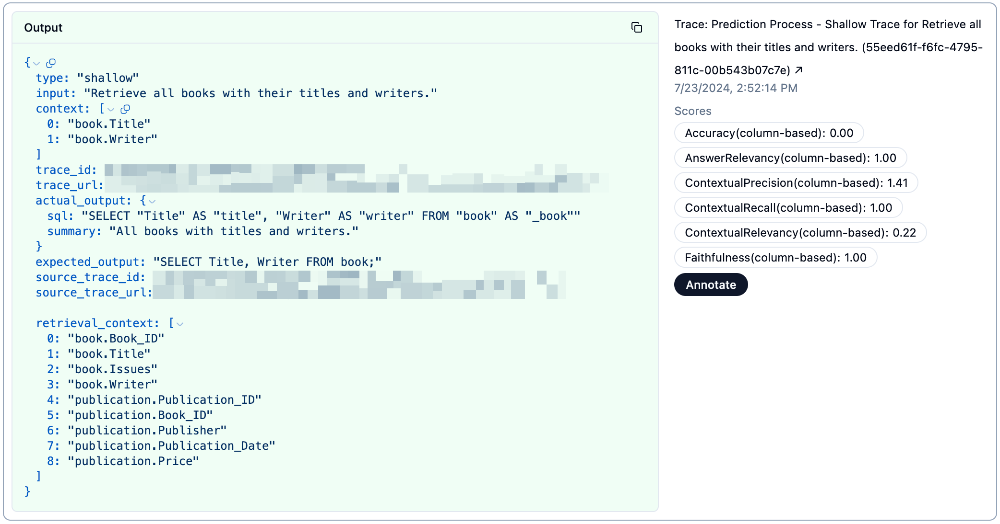

# Framework de Avaliacao

Este documento descreve o framework de avaliacao do Wren AI service. O framework foi projetado para avaliar desempenho com base nos componentes abaixo.

## Requisitos

1. **Instale o Just**: baixe e instale [Just](https://github.com/casey/just?tab=readme-ov-file#packages) para executar os comandos de avaliacao.
2. **Configure Langfuse**: crie uma conta em [Langfuse](https://cloud.langfuse.com) e obtenha API key e secret. Preencha o arquivo `.env.dev` com essas credenciais.
3. **Inicie os servicos de desenvolvimento**: execute `just up` para iniciar os servicos necessarios.
4. **Arquivo de configuracao**: garanta que exista uma copia de `config.yaml` no diretorio `wren-ai-service/eval/`.

## Curadoria de dataset

O processo de curadoria prepara o dataset de avaliacao do Wren AI service. Para iniciar o app de curadoria:

- copie `.env.example` para `.env` e preencha as variaveis de ambiente
- execute em `wren-ai-service`: `just curate_eval_data`

## Preparacao do dataset de avaliacao (Spider 1.0 ou Bird)

```cli
just prep <dataset-name>
```

Atualmente, suportamos dois datasets para avaliacao:

- `spider1.0`: dataset Spider (padrao se nenhum for informado)
- `bird`: dataset Bird

O comando executa dois passos principais:

1. Faz download do dataset especificado para:

   ```txt
   wren-ai-service/tools/dev/etc/<dataset-name>
   ```

2. Prepara e salva datasets de avaliacao em:

   ```txt
   wren-ai-service/eval/dataset
   ```

   Os arquivos de saida seguem este padrao:

   - Dataset Spider: `spider_<db_name>_eval_dataset.toml`
   - Dataset Bird: `bird_<db_name>_eval_dataset.toml`

Cada dataset de avaliacao contem perguntas, consultas SQL e contexto relevante para testar a capacidade text-to-SQL do sistema.

## Schema do dataset de avaliacao

- dataset_id (UUID)
- date
- mdl
- eval_dataset

## Configurar datasource para predicao e avaliacao

Antes de iniciar predicao e avaliacao, configure corretamente o datasource. Isso garante acesso aos dados necessarios para previsoes e metricas.

### Para datasets Spider ou Bird

Para Spider ou Bird, e usado um datasource embutido. Isso significa que os dados ficam locais e sao acessados por um caminho especifico. Voce deve definir `eval_data_db_path` no `config.yaml`.

Exemplo no `config.yaml`:

```yaml
eval_data_db_path: "etc/bird/minidev/MINIDEV/dev_databases"
```

### Configurando BigQuery como datasource para outros MDLs customizados

Ao trabalhar com MDLs customizados que usam BigQuery, e essencial configurar o sistema corretamente para acessar os datasets necessarios. Isso envolve parametros no `config.yaml` ou no `.env.dev`. Ambos funcionam, mas `.env.dev` ajuda a manter credenciais sensiveis protegidas.

#### Codificando as credenciais

Voce pode usar o comando abaixo para codificar as credenciais:

```cli
cat <path/to/credentials.json> | base64
```

#### Configuracao em `config.yaml`

Para habilitar acesso ao dataset BigQuery, adicione os parametros abaixo ao `config.yaml`:

```yaml
bigquery_project_id: "your_project_id"
bigquery_dataset_id: "your_dataset_id"
bigquery_credentials: "your_credentials" # this is a base64 encoded string of the credentials
```

#### Configuracao em `.env.dev`

No `.env.dev`, use os parametros abaixo:

```env
BIGQUERY_PROJECT_ID="your_project_id"
BIGQUERY_DATASET_ID="your_dataset_id"
BIGQUERY_CREDENTIALS="your_credentials" # this is a base64 encoded string of the credentials
```

## Processo de predicao

O processo de predicao gera resultados sobre os dados de avaliacao usando o Wren AI service. Ele cria traces e uma sessao no Langfuse para disponibilizar os resultados ao usuario. Use o comando abaixo para prever datasets em `eval/dataset`:

```cli
just predict <evaluation-dataset>
```

Tambem e possivel prever sub-pipelines informando o nome do pipeline:

```cli
just predict <evaluation-dataset> <pipeline-name>
```

Atualmente suportamos os pipelines `ask`, `generation` e `retrieval`. Se nenhum nome for informado, o padrao e `ask`.

## Processo de avaliacao

O processo de avaliacao analisa resultados de predicao do Wren AI service. Ele compara os resultados com o ground truth e calcula metricas. Esse processo tambem adiciona um trace na mesma sessao do Langfuse para disponibilizar os resultados. Use o comando abaixo para avaliar arquivos em `outputs/predictions`:

```cli
just eval <prediction-result>
```

Observacao: se voce quiser habilitar comparacao semantica entre SQLs via LLM para melhorar a metrica de acuracia, preencha a OpenAI API key no `.env` em `wren-ai-service/eval` e adicione `--semantics` ao comando:

```cli
just eval <prediction-result> --semantics
```

Os resultados de avaliacao serao exibidos no Langfuse da seguinte forma:



## Termos

Esta secao descreve os termos usados no framework de avaliacao:

- **input**: consulta do usuario usada como entrada do Wren AI service (ex.: "What is the total number of COVID-19 cases in the US?").
- **actual_output**: SQL efetivamente gerado para obter a resposta (ex.: "SELECT SUM(cases) FROM covid19 WHERE country='US'").
- **expected_output**: SQL esperado para obter a resposta (ex.: "SELECT SUM(cases) FROM covid19 WHERE country='US'").
- **retrieval_context**: contexto relevante que ajuda o LLM a gerar SQL (ex.: "covid19.country", "covid19.cases").
- **context**: contexto relevante alinhado com a expectativa humana para gerar SQL (ex.: "covid19.country", "covid19.cases").

## Metricas

Esta secao descreve as metricas usadas no framework de avaliacao:

- **Accuracy**: proporcao entre SQLs corretos gerados e SQLs esperados. Verifica se o SQL gerado produz o resultado correto.
- **Answer Relevancy**: mede quao bem o LLM gera informacoes relevantes a partir da entrada recebida.
- **Faithfulness**: mede quao bem o LLM gera informacoes factualmente corretas e alinhadas ao retrieval_context, reduzindo alucinacoes e contradicoes.
- **Contextual Relevancy**: mede quao bem o retriever minimiza informacao irrelevante e maximiza a recuperacao de informacao relevante.
- **Contextual Recall**: mede quao bem o modelo de embedding identifica e recupera informacao relevante dado o contexto.
- **Contextual Precision**: mede quao bem o reranker posiciona nos relevantes no topo do ranking.
- **QuestionToReasoningJudge**: mede quao bem o LLM gera raciocinio alinhado com a pergunta.
- **ReasoningToSqlJudge**: mede quao bem o LLM gera SQL alinhado com o raciocinio.
- **SqlSemanticsJudge**: mede quao bem o LLM gera SQL semanticamente equivalente ao SQL esperado.
